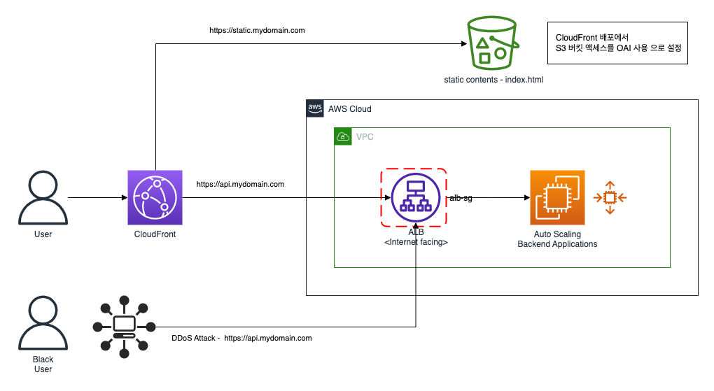

AWS 클라우드 환경에서 컴퓨팅 인스턴스에 대해 보안 그룹을 통해 세밀하고 유연하게 통제 하는 것은 매우 중요 합니다.

## 보안 그룹 개요

보안 그룹은 주로 VPC 내부의 컴퓨팅 인스턴스(EC2, RDS, ...)를 대상 으로 외부로부터 대상 인스턴스로 연결을 허용(inbound)하고 대상 인스턴스로부터 외부로의 연결(outbound)을 허용 하는
네트워크 트래픽을 제어합니다.


<br>

## 네트워크 연결 흐름

Bastion-EC2 인스턴스에 대해서 VPC 내부 또는 외부의 리소스가 VPC 내부의 컴퓨팅 인스턴스에 대해 연결을 허용 하려면 inbound 를 위한 ingress rule 을 설정 하여야 합니다.  
반대로, VPC 내부의 컴퓨팅 인스턴스가 VPC 내부 또는 외부의 리소스로 액세스 하려면 outbound 를 위한 egress rule 을 설정 해야 합니다.

아래는 Bastion EC2 에 대해 외부에서의 접근 허용과, 외부로의 액세스 허용을 위한 네트워크 흐름과 보안 그룹 규칙입니다.

### Case 1 - VPC 외부의 SSH 클라이언트가 보안 프로토콜을 통해 Bastion EC2 로 연결 하는 네트워크 트래픽 흐름


- bastion-sg 의 Ingress Rule 예시  
  `52.78.21.101` 아이피를 사용하는 SSH 클라이언트의 접속만을 허용하는 제한된 bastion-sg 보안 그룹의 Ingress 룰을 설정 하는 예시 입니다.


위와 같이 관리 콘솔을 통해 직접 설정 하가나, 아래와 같이 AWS CLI 를 통해 구성이 가능 합니다.

[AWS CLI](https://docs.aws.amazon.com/cli/latest/reference/ec2/authorize-security-group-ingress.html) 를 통한 ingress-rule
등록 예시

```shell
aws ec2 authorize-security-group-ingress --group-id $SECURITY_GROUP_ID \
  --ip-permissions IpProtocol=tcp,FromPort=22,ToPort=22,IpRanges='[{CidrIp=52.78.21.101/32,Description="SSH for Office"}]' \
  --tag-specifications "ResourceType=security-group-rule,Tags=[{Key=Name,Value=ssh-for-office}]" \
  --region $AWS_REGION 
```

### CASE 2 - VPC 내부의 Bastion EC2 인스턴스가 외부의 Git 저장소를 HTTPS 프로토콜로 연결 하는 네트워크 트래픽 흐름


- bastion-sg 의 Egress Rule 예시  
  bastion-ec2 는 외부 `Gihub 저장소`를 액세스 하기 하기 위해 bastion-sg 보안 그룹의 Egress 룰을 설정 하는 예시 입니다.


위와 같이 관리 콘솔을 통해 직접 설정 하가나, 아래와 같이 AWS CLI 를 통해 구성이 가능 합니다.

[AWS CLI](https://docs.aws.amazon.com/cli/latest/reference/ec2/authorize-security-group-egress.html) 를 통한 egress-rule 등록
예시

```shell
aws ec2 authorize-security-group-egress --group-id $SECURITY_GROUP_ID \
  --ip-permissions IpProtocol=tcp,FromPort=443,ToPort=443,IpRanges='[{CidrIp=0.0.0.0/0,Description="HTTPS for Github"}]' \
  --tag-specifications "ResourceType=security-group-rule,Tags=[{Key=Name,Value=https-for-github}]" \
  --region $AWS_REGION 
```

<br>

## 보안 그룹 규칙 주요 속성

Ingress / Egress 를 위한 보안 그룹 규칙을 설정하는 주요 속성은 다음과 같습니다.

| Attribute Name | Example Value         | Mandatory | Description                                                                                                      |
|----------------|-----------------------|-----------|------------------------------------------------------------------------------------------------------------------|
| Name           | ssh-for-office        | Optional  | 보안 그룹 규칙 이름으로 관리 콘솔 또는 CLI 를 통해 설정이 가능 합니다.                                      |
| Rule-ID        | sgr-0bcb48e7a01cfa310 | Auto      | 리소스 아이디는 자동으로 생성 되며, 수정 / 삭제에 대한 식별자로 사용 됩니다.                                  |
| IP Version     | IPv4                  | Auto      | IPv4 또는 IPv6 으로 자동으로 부여 됩니다.                                                           |
| Type           | SSH                   | Auto      | TCP, ICMP, UDP, HTTPS 등 여러 프로토콜을 지원 하고 있으며 해당하는 포트의 프로토콜 타입이며, 자동으로 부여 됩니다. |
| Protocol       | tcp                   | Y         | 허용할 프로토콜 입니다. 가장 일반적인 프로토콜은 6(TCP), 17(UDP) 및 1(ICMP)입니다.                         |
| Port (Range)   | 22                    | Y         | TCP, UDP 또는 사용자 지정 프로토콜의 경우 허용할 포트의 범위을 지정할 수 있습니다. <br> 단일 포트 번호(예: 22) 또는 포트 번호의 범위(예: 7000-8000)를 지정할 수 있습니다. |
| Source         | 52.78.21.101/32       | Y         | 허용할 트래픽에 대한 소스 입니다. 소스는 CIDR Block, IP Prefix List, Another Security Group Id 중 하나를 지정 할 수 있습니다. |
| Description    |                       | Optinal   | Ingress 또는 Egress 에 관련된 보안 그룹 규칙 설명입니다.  |

<br>

## 보안 그룹 고급 관리 전략

VPC 내부/외부 등 각 Tier 에 해당 하는 Source(CIDR, IP Prefix List, Security Group)에 대해 보안 그룹 정책을 촘촘하게 그리고 탄력적인 확장을 고려하여 설계 할 수
있습니다.

참고로, 보안 그룹은 Inbound 로 유입되는 트래픽에 대해 허용되면 Outbound 역시 모두 허용 됩니다.
[52.78.21.101/32] CIDR 블럭에 대해 22 번 포트를 Ingress 으로 허용 하는 규칙을 통해 SSH Client 가 Bastion EC2 에 접속 하면 별도의 Egreqss 에 대한 22번 포트를
허용 하는 규칙을 설정하지 않더라도 자동적으로 해당 포트(22) 에 대해 Egress 를 허용하게 됩니다.

<br>

클라이언트(예: 브라우저)가 VPC 의 ALB 뒤에 있는 애플리케이션에 어떻게 보안 강화를 하는지, 클라우드 인프라스트럭쳐와 애플리케이션 서비스를 위한 강화된 보안 그룹 관리 전략을 몇몇 예제로 풀어가고자 합니다.

### Case 1 - 애플리케이션 서비스 보안을 위한 Instance (Tier) 별 보안 그룹 정책  

아래 다이어그램은 클라이언트(예: 브라우저)가 VPC 의 ALB 뒤에 있는 애플리케이션에 액세스 하는 흐름과 각 Tier 에 해당 하는 컴퓨팅 인스턴스(ALB, Fargate, RDS)를 위한 별도의 보안 그룹이
정의된 것을 알 수 있습니다.  
이처럼, 각 Tier 마다 보안 그룹을 관리 하게 되면 보다 세밀한 액세스 정책을 적용할 수 있고, 컴퓨팅 인스턴스마다 해당하는 보안 그룹이 있음을 암묵적으로 알게 됩니다. 또한 인스턴스와 보안 그룹의 네이밍 규칙을
일관되게 관리 한다면 보다 쉽게 식별하고 자동화 할 수 있게 됩니다.


- 각 Instance (Tier) 마다 필요한 액세스를 조건을 기술 하면 아래와 같습니다.

| Instance (Tier) | Requierment                                                                                              |
|-----------------|----------------------------------------------------------------------------------------------------------|
| Client          | 클라이언트는 443 HTTPS 프로토콜을 통해 user-service 애플리케이션을 액세스 할 수 있어야 합니다.                                          |
| ALB             | 인터넷 클라이언트(사용자)가 HTTPS 프로토콜을 통해 액세스 하는 것을 허용하고, HOST 또는 URL 에 해당하는 user-service 애플리케이션 서비스로 라우팅 합니다.      |
| user-service    | ALB 로부터 8080 (tcp) 프로토콜을 통해 액세스 하는것을 허용하고, 처리된 데이터를 저장하기 위해 3306 (tcp) 프로토콜로 RDS 데이터베이스에 액세스할 수 있어야 합니다. |
| RDS             | user-service 애플리케이션으로부터 데이터 저장을 위해 3306 (tcp) 프로토콜로 요청 되는 액세스를 허용해야 합니다.                                 |

- 각 Instance (Tier) 에 대한 보안 그룹을 설정 하면 다음과 같습니다.

| Instance (Tier) | Security Group  | Rule Type | Source        | Port | Value                                 |
|-----------------|-----------------|-----------|---------------|------|---------------------------------------|
| ALB             | alb-sg          | Ingress   | CIDR          | 443  | [0.0.0.0/0]                           |
| user-service    | user-service-sg | Ingress   | Security-Grup | 8080 | <alb-sg-security-group-id>            |
| user-service    | user-service-sg | Egress    | Security-Grup | 3306 | <rds-sg-security-group-id>            |
| RDS             | rds-sg          | Ingress   | Security-Grup | 3306 | <user-service-sg-security-group-id>   |


<br>

- 외부 클라이언트가 접근하는 인스턴스는 ALB 입니다. 만약 외부 클라이언트가 액세스하는 IP 대역이 정해져 있다면 ALB 의 Ingress CIDR 범위를 세밀하게 지정하여 제한 할 수 있습니다.  
예로, 외부 클라이언트가 `121.78.101.1 `부터 `121.78.101.255 `까지 IP 대역으로 접근을 한다면 `alb-sg ` 보안 그룹의 Ingress CIDR 대역을 `[121.78.101.0/24] `으로 제한하여 설정 할 수 있습니다.

| Instance (Tier) | Security Group  | Rule Type | Source        | Port | Value |
|-----------------|-----------------|-----------|---------------|------|-------|
| ALB             | alb-sg          | Ingress   | CIDR          | 443  | [121.78.101.0/24]  |


<br>

### Case 2 - 애플리케이션 서비스 보안을 위한 공유 인스턴스의 보안 그룹 바인딩 

아래 다이어그램은 새롭게 추가된 `order-service` 애플리케이션에 대한 보안 그룹 관리 정책 입니다.  


`Case 1` 과 같은 방법으로 보안 그룹을 기술 하게 되면 아래와 같습니다. 

| Instance (Tier) | Security Group   | Rule Type | Source        | Port | Value                                |
|-----------------|------------------|-----------|---------------|------|--------------------------------------|
| ALB             | alb-sg           | Ingress   | CIDR          | 443  | [0.0.0.0/0]                          |
| user-service    | user-service-sg  | Ingress   | Security-Grup | 8080 | <alb-sg-security-group-id>           |
| user-service    | user-service-sg  | Egress    | Security-Grup | 3306 | <rds-sg-security-group-id>           |
| order-service   | order-service-sg | Ingress   | Security-Grup | 8081 | <alb-sg-security-group-id>           |
| order-service   | order-service-sg | Egress    | Security-Grup | 3306 | <rds-sg-security-group-id>           |
| RDS             | rds-sg           | Ingress   | Security-Grup | 3306 | <user-service-sg-security-group-id>  |
| RDS             | rds-sg           | Ingress   | Security-Grup | 3306 | <order-service-sg-security-group-id> |

물론 `order-service` 를 위한 별도의 `order-service-sg` 보안 그룹을 구성하여 관리하는 것은 일관된 규칙의 좋은 모델 입니다.  
하지만 `RDS` 와 같은 공유 Instance 에 대해 user-service, order-service 처럼 다수의 애플리케이션이 rds 를 액세스 하기 위한 Egress 규칙을 구성해야 하고,
`RDS`는 이 같은 다수의 애플리케이션 으로부터 접근을 허용 하기 위한 Ingress 규칙이 설정 해야 합니다.  
앤터프라이즈와 같은 대규모의 워크로드에서 위와 같은 방법으로 보안 그룹을 통제 하는 것은 어려울 수 있습니다.  

<br>

위의 문제를 해결하는 방법으로 아래 다이어그램과 같이, 애플리케이션 인스턴스에 RDS 와 같은 공유 인스턴스 접근을 위한 별도의 (공유 인스턴스를 위한) 보안 그룹(rds-ssg)을 바인딩(binding) 하고, RDS 의 보안 그룹은 `rds-ssg` 에 대해서만 접근을 허용 하도록 하는 것 입니다.   

 

- `rds-ssg` 는 소스 RDS 로 outbound 액세스를 위해 `rds-sg`를  대상으로 3306 프로토콜을 Egress 규칙을 허용 합니다. 
- `rds-sg` 는 애플리케이션이 3306 프로토콜로 접근 하는 소스 `rds-ssg` 로부터 액세스를 허용하기 위해 Ingress 규칙을 허용 합니다. 


이런식으로 `order-service` 와 같은 신규 애플리케이션이 계속해서 추가되더라도, 해당 애플리케이션에 공유 인스턴스를 위한 보안 그룹(rds-ssg)을 할당 하는 방식으로하면 보다 쉽운 방법으로 액세스 정책을 관리 할 수 있습니다. 


`Case 2` 공유 보안 그룹(shared-security-group: ssg) 추가를 통한 액세스 정책 관리는 아래와 같습니다.

| Instance (Tier) | Security Group   | Rule Type | Source        | Port | Value                         |
|-----------------|------------------|-----------|---------------|------|-------------------------------|
| ALB             | alb-sg           | Ingress   | CIDR          | 443  | [0.0.0.0/0]                   |
| user-service    | user-service-sg  | Ingress   | Security-Grup | 8080 | <alb-sg-security-group-id>    |
| user-service    | rds-ssg          | Egress    | Security-Grup | 3306 | <rds-sg-security-group-id>    |
| order-service   | order-service-sg | Ingress   | Security-Grup | 8081 | <alb-sg-security-group-id>    |
| order-service   | rds-ssg          | Egress    | Security-Grup | 3306 | <rds-sg-security-group-id>    |
| RDS             | rds-sg           | Ingress   | Security-Grup | 3306 | <rds-ssg-security-group-id>   |

결론적으로 다음과 같이 쉽고 간편하게 관리 할 수 있습니다. 
- `RDS` 인스턴스를 위한 `rds-sg` 보안 그룹은 `order-service` 와 같은 새로운 애플리케이션이 추가된다 하더라도 변경 사항이 없습니다.
- `order-service` 와 같은 신규 애플리케이션이 RDS 를 액세스 하려면 `rds-ssg` 보안 그룹을 binding 하는 것 만으로 설정이 완료 됩니다.  

보안 그룹을 binding 하는 방식의 아키텍처는 아래와 같습니다. 


**주의 사항** : EC2, Fargate, Lambda 등 컴퓨팅 인스턴스가 사용하는 [네트워크 인터페이스당 보안 그룹](https://docs.aws.amazon.com/ko_kr/vpc/latest/userguide/amazon-vpc-limits.html#vpc-limits-security-groups)  최대 갯수는 5개로 제한 되어 있습니다. 
이 것의 의미는 하나의 애플리케이션이 RDS, ElastiCache, Message-Broker 등 공유 인스턴스를 액세스 할 수 있는 수가 제한 된다는 것이며, 애플리케이션은 Microservice 와 같이 비즈니스 도메인에 해당하는 데이터 저장소만 액세스 하도록 설계하는 것이 중요 합니다. 
이렇게 하면 세밀한 보안 그룹 정책은 물론 컴퓨팅 인스턴스 Scale-Out 아키텍처도 보다 유연하게 설계되는 장점이 있습니다.  


<br>

### 관리형 접두사 목록 사용

[관리형 접두사 목록을 사용 하여 CIDR 블록 그룹화](https://docs.aws.amazon.com/ko_kr/vpc/latest/userguide/managed-prefix-lists.html)를 통해 
접속 클라이언트 IP 를 위한 Pool 을 쉽게 관리하고 이를 위한 보안 그룹 액세스 정책을 적용할 수 있습니다. 


#### Case 1 - 클라우드 운영 담당자에 대한 제한된 접근 관리 
운영 담당자는 On-Premise 네트워크의 VPN 을 통해 AWS 클라우드를 관리하기 위해 VPC 안의 Bastion-EC2 로 제한된 접근을 할 수 있습니다. 
On-Premise 의 NAT 역할을 하는 인스턴스(public ip)로 Customer Gateway 가 생성 되며 Site-to-Site 방식으로 VPN 이 연결 되고,  
On-Premise 네트워크의 Private CIDR 대역이 ["10.10.101.0/24", "10.10.102.0/24", "10.10.201.0/24", ""10.10.202.0/24"] 이라고 할 때 `관리형 접두사 목록` 으로 제한된 보안 그룹 규칙을 쉽고 편리하게 적용 할 수 있습니다. 


위 아키텍처에서 관리형 접두사 목록 `pl-023ef34fab3` 으로 제한된 IP 대역을 ["10.10.101.0/24", "10.10.102.11/32", "10.10.102.12/32", "10.10.102.13/32"] 으로 정의 하고 있습니다.   

`bastion-sg`, `rds-sg` 보안 그룹의 Ingress 규칙을 아래와 같이 설정 하게 되면, Site-to-Site VPN 연결을 통해 접속하는 IP 대역 중 관리형 접두사 목록 `pl-023ef34fab3` 에 해당하는 IP 만 접속을 허용 하게 됩니다.   
`pl-023ef34fab3` 에 해당하는 운영 담당자는 VPC 내부의 Bastion-EC2 를 22 포트로 접속할 수 있고, Aurora RDS 를 3306 포트로 접속 할 수 있게 됩니다.     

| Instance (Tier) | Security Group | Rule Type | Source              | Port | Value               |
|-----------------|----------------|-----------|---------------------|------|---------------------|
| bastion         | bastion-sg     | Ingress   | Managed Prefix List | 22   | pl-023ef34fab3      |
| RDS             | rds-sg         | Ingress   | Managed Prefix List | 3306 | pl-023ef34fab3      |


<br>


#### Case 2 - CloudFront 를 위한 제한된 접근 관리

포탈 서비스는 주로 CloudFront 와 같은 CDN 서비스를 통해 배포 됩니다. 아래의 아키텍처는 CloudFront 로 2가지 유형의 컨텐츠를 제공 하고 있습니다.   
1. index.html 등 리소스를 S3 버킷에 업로드하고 CloudFront OAI 로 배포 되어 제공되는 정적 컨텐츠 
2. VPC 내의 ALB 뒷족의 backend 애플리케이션을 통해 제공 되는 동적 컨텐츠(정보)



문제는 ALB 와 S3 버킷이 public 으로 접근이 될 수 있으며 `Cracker`에 의해 DDoS 공격에 무방비로 당할 수 있는 점 입니다. 
이 문제를 해결하는 좋은 방법은 
- CloudFront 가 S3에 저장된 Private 객체에 액세스 할 수 있도록 하는 OAI (Origin Access Identity) 방식으로 배포 하고
- AWS 에서 사전에 정의된 [CloudFront 관리형 접두사 목록](https://docs.aws.amazon.com/ko_kr/AmazonCloudFront/latest/DeveloperGuide/LocationsOfEdgeServers.html)을 기반으로 ALB 의 보안 그룹을 구성 하는 것 입니다. 

사전에 정의된 CloudFront 관리형 접두사 목록 이름은 `amazonaws.global.cloudfront.origin-facing` 으로 정의 되어 있습니다. 만약 `amazonaws.global.cloudfront.origin-facing` 의 아이디가 `pl-22a6434b` 이라면 아래와 같이 구성 하면 됩니다. 

| Instance (Tier) | Security Group | Rule Type | Source              | Port | Value        |
|-----------------|----------------|-----------|---------------------|------|--------------|
| ALB             | alb-sg         | Ingress   | Managed Prefix List | 443  | pl-22a6434b  |


추가로, `ap-northeast-2` 리전에 대해서만 CloudFront 액세스를 하기 위해 사용자 정의 CloudFront 접두사 목록을 `pl-ddff123456`와 같이 구성 할 수도 있습니다.  

| Instance (Tier) | Security Group | Rule Type | Source              | Port | Value         |
|-----------------|----------------|-----------|---------------------|------|---------------|
| ALB             | alb-sg         | Ingress   | Managed Prefix List | 443  | pl-ddff123456 |

-  `ap-northeast-2` 리전에 해당하는 CloudFront IP 컬렉션 조회 예시 
```shell
curl https://ip-ranges.amazonaws.com/ip-ranges.json \
  | grep -B 2 CLOUDFRONT \
  | grep -B 1 "ap-northeast-2" \
  | grep 'ip_prefix' \
  | awk '{ print $2 }' \
  | tr -d '",' \
  | xargs -I{} 
```

`pl-ddff123456` 사용자 정의 CloudFront 접두사 목록의 IP 항목 내용 
```
13.124.199.0/24
13.124.199.0/24
3.35.130.128/25
52.78.247.128/26
```

참고로, Amazon Web Services(AWS)는 현재 IP 주소 범위 [ip-ranges.json](https://ip-ranges.amazonaws.com/ip-ranges.json)를 JSON 형식으로 게시합니다. 또한 변경이 있을때마다 `ip-ranges.json` 은 갱신 됩니다.


<br>

## Conclusion

지금까지 AWS Security Group 을 살펴 보앗습니다. 여기서 우리는 보안 그룹이 네트워크 보안을 위해 세밀하고 확장 가능한 매우 강력한 기능을 제공 하고 있음을 알 수 있었습니다. 
위의 몇가지 사례(Case) 에서 보듯이 효과적으로 통제 하는 것은 어려울 수 있지만, 일관된 원칙을 세우고 보다 간단하고 쉽게 확장할 수 있는 아키텍처 모형을 위해 지속적으로 발전시켜 나간다면 대형 앤터프라이즈 워크로드를 대상으로도 자동화 운영 관리 할 수 있을 것입니다.  

향후에 Terraform 을 통해 AWS 클라우드에 간단한 스택을 올려서 확인 할 수 있는 프로젝트를 공유 하도록 하겠습니다.  

<br>

## References

- [보안 그룹을 사용하여 리소스에 대한 트래픽 제어](https://docs.aws.amazon.com/vpc/latest/userguide/VPC_SecurityGroups.html)
- [관리형 접두사 목록을 사용하여 CIDR 블록 그룹화](https://docs.aws.amazon.com/vpc/latest/userguide/managed-prefix-lists.html)
- [CloudFront 관리형 접두사 목록 사용](https://docs.aws.amazon.com/AmazonCloudFront/latest/DeveloperGuide/LocationsOfEdgeServers.html#managed-prefix-list)
- [CloudFront 엣지 서버의 위치 및 IP 주소 범위](https://docs.aws.amazon.com/AmazonCloudFront/latest/DeveloperGuide/LocationsOfEdgeServers.html)
