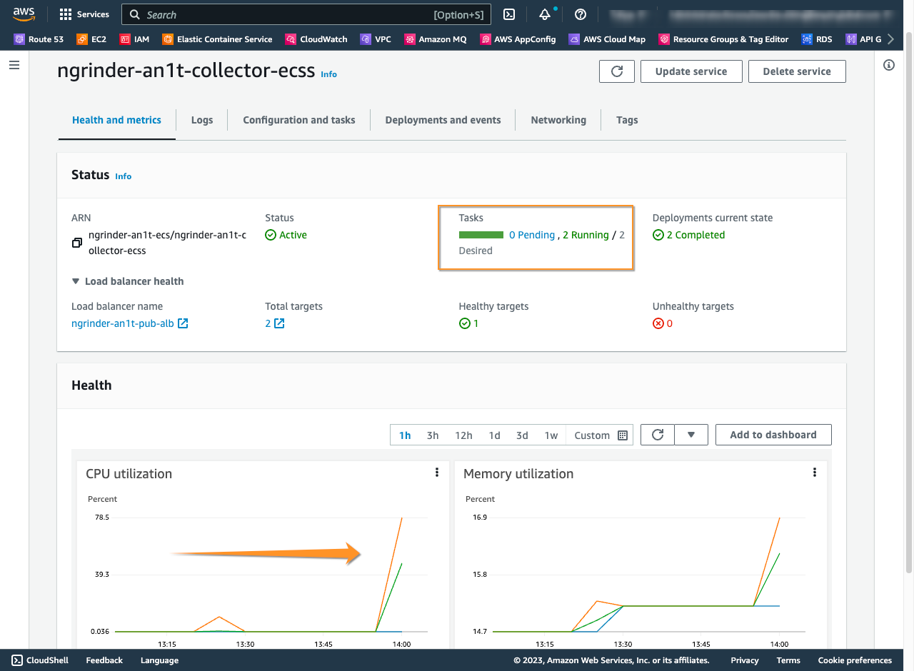

AWS Fargate 서비스와 nGrinder 융합으로 자동화 성능 테스트를 어떻게 활용하는지 그 방법을 살펴봅니다.


## Background

애플리케이션 스트레스 테스트는 애플리케이션이 특정 사용자 수나 트래픽을 처리할 수 있는 한계를 시뮬레이션하여, 시스템의 안정성과 성능을 평가하는 테스트로
이를 통해 시스템의 안정성, 확장성, 성능 등을 검증하고 개선할 수 있으므로 중요한 활동입니다.

주요 잇점은 다음과 같습니다.

#### 1. 애플리케이션의 성능 검증

애플리케이션이 어떠한 상황에서도 일정한 성능을 유지할 수 있는지 확인합니다.  
예를 들어, 사용자가 동시에 많은 요청을 보내는 경우, 애플리케이션의 응답 시간이 급격하게 증가하게 되는데 이러한 상황에서 애플리케이션이 적절하게 대응할 수 있는지 확인합니다.

#### 2. 애플리케이션의 안정성 검증

애플리케이션이 오류 또는 충돌을 일으키지 않고, 예상치 못한 상황에서도 안정적으로 동작할 수 있는지 확인합니다.

#### 3. 확장성 검증

애플리케이션이 트래픽이 증가할 때 쉽게 확장될 수 있는지 확인합니다. 이를 통해 사용자 수가 증가함에 따라 애플리케이션이 어떻게 확장되는지에 대한 전략을 수립할 수 있습니다.
AWS 의 Auto-Scaling 정책과 Serverless Lambda 는 탄력적인 확장을 계획하고 구성하는데 편리 합니다.

#### 4. 문제점 및 병목 현상 발견

스트레스 테스트를 수행함으로써 애플리케이션의 문제점과 병목 현상을 식별할 수 있습니다.
이를 통해 개발자들은 애플리케이션 코드를 최적화하고 프로세스 개선 등 성능을 향상시키는 데 필요한 활동을 진행할 수 있습니다.

#### 5. 서비스 수준 계약(SLA) 준수 확인

애플리케이션이 SLA 항목을 계획하고 메트릭ㅂ을 정의하므로써 고객에게 서비스 수준에 대한 보장을 제공할 수 있습니다.


<br>

하지만 Stress 테스트는 다른 테스트에 비해 시간 및 비용이 많이 발생하므로 진행하기가 쉽지 않습니다.

어려운 점을 살펴 보면

#### 1. 높은 하드웨어 및 소프트웨어 요구 사항

스트레스 테스트는 대규모의 사용자, 트래픽 및 데이터를 시뮬레이션해야 하므로 매우 높은 하드웨어 및 소프트웨어 요구 사항이 필요합니다. 이에 따라, 고성능의 컴퓨터, 서버, 네트워크 장비 등이 필요할 수 있습니다.

#### 2. 복잡한 시나리오 및 데이터

스트레스 테스트는 다양한 시나리오 및 데이터를 사용하여 시스템의 한계를 탐색해야 합니다.
이러한 시나리오 및 데이터는 다양한 사용자의 행동, 환경, 네트워크 지연 등을 반영해야 하므로 준비 및 구성하는 데 많은 시간과 비용이 소요됩니다.

#### 3. 테스트 환경 설정 및 모니터링

스트레스 테스트를 수행하기 위해서는 테스트 환경을 설정하고 테스트 수행 중에 시스템 및 성능 모니터링을 수행해야 합니다.
이를 위해서는 전문적인 지식과 경험이 필요하며, 이에 따른 비용이 발생할 수 있습니다.

#### 4. 결과 분석 및 보고서 작성

스트레스 테스트 결과를 분석하고 보고서를 작성하는 것은 매우 중요합니다. 이를 위해서는 전문적인 기술과 지식이 필요하며, 이에 따른 시간과 비용이 소요됩니다.

<br>

스트레스 테스트를 제대로 계획하고 이행하려면 위와 같이 매우 복잡하고 전문적인 지식과 경험이 필요한 활동으로, 시간 및 비용이 많이 소요됩니다.

정말 DevOps 스럽지 않은데요, 여기서는 AWS Fargate 와 nGrinder 오픈소스를 융합하여 손쉽게 스트레스 테스트를 수행 하도록 하겠습니다.

<br>

## nGrinder Architecture

[nGrinder Architecture](https://github.com/naver/ngrinder/wiki/Architecture) 는 Controller 와 Agent 로 구성된
클러스터 환경으로 동적으로 부하 규모를 구성 할 수 있을 뿐만 아니라, 테스트 진행 현황과 메트릭을 종합적으로 확인 할 수 있습니다.  
또한 개발자에게 익숙한 스크립트 방식으로 테스트 시나리오를 계획하고 즉시 진행 할 수 있는 점 또한 큰 매력 입니다.    


<br><br>

## AWS Solutions Architecture

nGrinder 부하 테스트를 위한 AWS 스택을 위한 솔루션즈 아키텍처로 다음과 같이 ECS 를 활용한 Serverless 기반으로 디자인 하였습니다.


<br>

## 프로젝트 정보

AWS 클라우드 설계시 일관된 리소스 관리를 위한 정책을 계획하기 위해 주요 Context 정보를 정의 하고 각 리소스 및 태깅 속성에 자동화 적용 하는 것은 중요합니다.

다음은 프로젝트 컨텍스트 정보를 정의 하는 기본적인 예시 입니다.

| Name           | Description                  | 
|----------------|------------------------------|
| Project        | ngrinder                     |
| Region         | ap-northeast-1               |
| Environment    | Testbed                      |
| Team           | DevOps                       |
| Domain         | sympleops.ga                 |
| Private Domain | sympleops.local              |
| Owner          | admin@symplesims.io          |
| Apps           | controller, agent, collector |

## ngrinder-aws-stack

[ngrinder-aws-stack](https://github.com/chiwoo-cloud-native/ngrinder-aws-stack) 테라폼 프로젝트는 위의 솔루션즈 아키텍처를 One-Step 으로
자동화 구성합니다.   
특히, 리소스 네이밍 및 태깅 규칙을 프로젝트 컨텍스트 정보를 기반으로 일관되게 정의하고 있으므로 보다 효과적으로 운영 관리 할 수 있습니다.

<br>

### 주요 리소스 구성 및 특징

위의 솔루션즈 아키텍처는 아래와 같은 AWS 주요 서비스를 생성 하며, Serverless 서비스를 사용하여 사람의 개입을 최소화 하도록 설계 하였습니다.

| Service    | Resource        | Description                                                                                                                                  |
|------------|-----------------|----------------------------------------------------------------------------------------------------------------------------------------------|
| Route53    | Hosting         | DNS 네임에 해당하는 호스팅 서비스를 제공 합니다. Public / Private 호스팅 서비스가 있습니다.                                                                                |
| VPC        | IGW             | 인터넷 서비스를 위한 리소스 입니다.                                                                                                                         |
| VPC        | NAT             | VPC 내부의 리소스가 인터넷 서비스를 액세스 하기위한 NAT 리소스 입니다.                                                                                                  |
| VPC        | Public Subnet   | Public Load Balacner 를 위한 전용 서브넷 입니다.                                                                                                        |
| VPC        | LB Subnet       | Private Load Balacner 를 위한 전용 서브넷 입니다.                                                                                                       |
| VPC        | App Subnet      | Application 배치를 위한 전용 서브넷 입니다.                                                                                                               |
| VPC        | Data Subnet     | RDS 등 Database 클러스터 배치를 위한 전용 서브넷 입니다.                                                                                                       |
| EC2        | ALB             | 인터넷 사용자의 요청을 서비스 하고 분산 / 라우팅을 위한 Public Load Balacner 입니다.                                                                                   |
| EC2        | Security Group  | 컴퓨팅 인스턴스의 In-bound/Out-bound 트래픽을 제어하기 위한 가상의 방화벽 입니다. 각 인스턴스별로 보안그룹을 생성하고 통제하는 것을 권장 합니다.                                                   |
| ECS        | Cluster         | ECS 애플리케이션을 오케이스트레이션 하는 클러스터 서비스 입니다. Capacity 정책으로 FARGATE, FARGATE_SPOT 이 있습니다.                                                            |
| ECS        | Task Definition | ECS 애플리케이션 시작과 서비스를 위한 컨테이너 및 환경 정보를 정의 합니다.                                                                                                 |
| ECS        | Service         | ECS 작업 정의에의해 생성된 애플리케이션 서비스 인스턴스 입니다. 실제 물리적인 자원과 통합되어 있으며 ECS Auto-Scaling 정책 등을 구성 가능 합니다.                                                 |
| CloudMap   | Namespace       | ECS 애플리케이션을 식별하고 일관된 접속 주소를 제공하는 Discovery 입니다. 또한 Route 53과 통합되어 DNS 쿼리를 지원 합니다.                                                            |
| IAM        | Role            | ECS 애플리케이션이 ECS 클러스터에 배포 및 확장 하고 다른 AWS 서비스(예: S3,)를 액세스 하기 위한 역할로 ECS 태스크를 위해선 서비스 역할 유형으로 `ecs-tasks.amazonaws.com` 에 대해 신뢰관계로 구성 하여야 합니다. |
| IAM        | Policy          | ECS 애플리케이션의 액세스 정책을 정의 합니다.                                                                                                                  |
| CloudWatch | Log Group       | 애플리케이션 로그를 기록하는 로그 그룹 입니다.                                                                                                                   |
| CloudWatch | Metrics / Alarm | 애플리케이션 주요 Metric(예: CPU, Memory) 의 Threshold 를 기준으로 지표를 수집하고 경보를 발생 합니다.                                                                     |
| S3         | Bucket          | 수집된 Data 를 적재하기 위한 스토리지 서비스 입니다.                                                                                                             |

<br>

## nGrinder 테스트 가이드

nGrinder 를 통해 부하 테스트를 계획하고 실행하는 방법은 쉽고 직관적 입니다.


<br>

### 1. nGrinder 테스트 환경을 준비 합니다.
우리는 [ngrinder-aws-stack](https://github.com/chiwoo-cloud-native/ngrinder-aws-stack) 으로 AWS 클라우드 환경 위에 수 분안에 구성이 가능 합니다.

<br>

### 2. nGrinder 에 로그인 하고 테스트 스크립트를 작성 합니다.

ALB DNS 주소를 브라우저 주소창에 기입 하고 로그인 합니다.


<br>

- 초기 비밀 번호는 admin / admin 입니다.


<br>

- 화면 상단 `Script` 메뉴를 열고 `Create` 버큰을 클릭 하여 테스트용 스크립트를 작성 합니다.

- 

<br>

- `Create a Script` 팝업 창에서 아래와 같이 주요 정보를 입력 합니다.  
  고급 옵션을 설정 하기 위해 `Show Advanced Configuration` 버튼을 클릭 하여 확장 하고 추가 정보를 입력 하면 자동으로 생성되는 코드가 더 풍부해 집니다. 


| Name             | Description                                                                                          |
|------------------|------------------------------------------------------------------------------------------------------|
| Script Name      | 테스트 스크립트 이름을 기입 합니다. 20 자 미만으로 작성하여야 하며, 테스트 계획을 작성할 수 있는 스크립트 유형은 Groovy, Jython 두 가지로 작성 할 수 있습니다. |
| URL to be tested | 테스트 대상 애플리케이션 주소를 기입 합니다. RESTFul 메서드(GET, POST, ...) 유형에 따라 URI 를 입력 합니다.                           |
| Headers          | 요청 헤더를 추가할 수 있습니다. 여기선 `Content-Type` 헤더 값으로 `application/json` 을 선택 하였습니다.                          |
| Cookies          | 필요한 경우 쿠키 속성과 값을 설정 합니다.                                                                             |
| Body             | 요청 Payload(전문)을 작성 합니다. 여기선 JSON 값을 기입 하였습니다.                                                        |


기입을 완료 했으면 `Create` 버튼을 클릭 합니다.

<br>

- `Script` 편집 화면을 통해 우리가 원하는 테스트 시나리오를 Groovy 또는 Jython(Python) 스크립트로 작성 할 수 있습니다.  
화면에서 보듯이 Java 개발자라면 너무나 익숙한 JUnit 테스트 케이스를 작성하는것과 동일한것을 알 수 있습니다. 


자동 생성된 코드는 아래와 같습니다. 우리는 원하는 시나리오를 JUnit 프레임워크에 맞추어 자유롭게 구현할 수 있습니다.  

```
import static net.grinder.script.Grinder.grinder
import static org.junit.Assert.*
import static org.hamcrest.Matchers.*
import net.grinder.script.GTest
import net.grinder.script.Grinder
import net.grinder.scriptengine.groovy.junit.GrinderRunner
import net.grinder.scriptengine.groovy.junit.annotation.BeforeProcess
import net.grinder.scriptengine.groovy.junit.annotation.BeforeThread
// import static net.grinder.util.GrinderUtils.* // You can use this if you're using nGrinder after 3.2.3
import org.junit.Before
import org.junit.BeforeClass
import org.junit.Test
import org.junit.runner.RunWith

import org.ngrinder.http.HTTPRequest
import org.ngrinder.http.HTTPRequestControl
import org.ngrinder.http.HTTPResponse
import org.ngrinder.http.cookie.Cookie
import org.ngrinder.http.cookie.CookieManager

/**
* A simple example using the HTTP plugin that shows the retrieval of a single page via HTTP.
*
* This script is automatically generated by ngrinder.
*
* @author admin
*/
@RunWith(GrinderRunner)
class TestRunner {

	public static GTest test
	public static HTTPRequest request
	public static Map<String, String> headers = [:]
	public static String body = "{ \"id\": \"I1002\", \"name\": \"yyjehcti1o\", \"birthday\": \"1978-04-05\", \"height\": 167, \"weight\": 64, \"timestamp\": 681290122416 }"
	public static List<Cookie> cookies = []

	@BeforeProcess
	public static void beforeProcess() {
		HTTPRequestControl.setConnectionTimeout(300000)
		test = new GTest(1, "ngrinder-an1t-pub-alb-993527877.ap-northeast-1.elb.amazonaws.com")
		request = new HTTPRequest()

		// Set header data
		headers.put("Content-Type", "application/json")
		grinder.logger.info("before process.")
	}

	@BeforeThread
	public void beforeThread() {
		test.record(this, "test")
		grinder.statistics.delayReports = true
		grinder.logger.info("before thread.")
	}

	@Before
	public void before() {
		request.setHeaders(headers)
		CookieManager.addCookies(cookies)
		grinder.logger.info("before. init headers and cookies")
	}

	@Test
	public void test() {
		HTTPResponse response = request.POST("http://ngrinder-an1t-pub-alb-993527877.ap-northeast-1.elb.amazonaws.com/api/collect", body.getBytes())

		if (response.statusCode == 301 || response.statusCode == 302) {
			grinder.logger.warn("Warning. The response may not be correct. The response code was {}.", response.statusCode)
		} else {
			assertThat(response.statusCode, is(200))
		}
	}
}

```

- 위 코드에서 `@Test` 애노테이션이 실제로 대상 서비스에 요청을 하는 부분 입니다.  
코드를 보면 요청 payload 가  `body.getBytes()` 로 정해진 값을 요청 합니다.  
여기서는 데이터 타입을 동적으로 랜덤하게 생성하여 요청 하도록 아래와 같이 변경해 봅시다.  

그리고, 요청에 대한 응답이 200 으로 되어 있는데 201 로 변경 합시다. 샘플 collector 애플리케이션이 데이터를 적재하면 HttpsCode 응답을 201 로 리턴 합니다.
 

```
  static final Random rand = new Random()
  
  String payload() {
      Integer id     = rand.nextInt(60001 - 10001) + 10001
      String name    = Long.toString(Math.abs(rand.nextLong() % 3656158440062976L), 36);
      Integer height = rand.nextInt(190 - 165) + 165
      Integer weight = rand.nextInt(100 - 46) + 46
      Integer year   = rand.nextInt(2003 - 1970) + 1970
      Integer mon    = rand.nextInt(12 - 1) + 1
      Integer day    = rand.nextInt(31 - 1) + 1
      Long    now    = System.currentTimeMillis()
      return "{ \"id\": \"I" + id + "\", \"name\": \"" + name + "\", \"birthday\": \"" + year + "-" + mon + "-" + day  + "\", \"height\": "+height+", \"weight\": "+weight+",\n \"timestamp\": "+now+"}"
  }

  @Test
  public void test() {
    HTTPResponse response = request.POST("http://ngrinder-an1t-pub-alb-993527877.ap-northeast-1.elb.amazonaws.com/api/collect", payload().getBytes())
  
    if (response.statusCode == 301 || response.statusCode == 302) {
      grinder.logger.warn("Warning. The response may not be correct. The response code was {}.", response.statusCode)
    } else {
      assertThat(response.statusCode, is(201))
    }
  }
```

<br>

- 변경한 코드를 기입 했다면 상단의 `Validate` 버튼을 클릭 하여 Errors 가 없는지 확인하고 `Save`를 클릭하여 스크립트를 저장 합니다.  


<br>

### 3. 부하 규모를 조정 합니다.  

- `admin` 의 `Agent Management` 메뉴를 확인하면 현재 부하 발생 에이전트 현황을 확인 할 수 있습니다.  


<br>

- Agent 갯수를 늘리려면 ECS 의 'agent' 서비스의 `Desired tasks` 수를 조정 하면 됩니다.  


<br>

### 4. 성능 테스트 시나리오를 계획 합니다.

- `Performance Test` 메뉴의 `Create Test` 버튼을 클릭하고 성능 테스트 시나리오를 구성 합니다. 


테스트 가능한 Agent 가 현재 Max 2 개 인데, ECS 클러스터에서 desired count 수를 조정 함으로써, 부하 규모을 탄력적으로 조정 할 수 있습니다.  

Process 와 Threads 는 ECS 서비스의 CPU 리소스에 의존 합니다. 너무 많은 수를 입력 하면 부하를 발생하는 Agent 가 동작하지 않으니 적절하게 입력 합니다. 

`Show Advanced Configuration` 을 클릭하고  `Connection reset on each test run`, `Safe File Distribution` 그리고 `Ignore Errors` 속성을 체크 합니다. 

`Ramp-Up` 기능을 체크하면 성능 테스트에서 초기 사용자/요청 수를 점진적으로 증가시켜 시스템 부하를 안정적으로 계획할 수 있습니다.  
대규모 트래픽이 몰리는 상황에 대비하여 시스템의 성능 및 안정성을 평가할 때 유용 합니다.  


<br>

### 5. 스트레스(부하) 테스트를 시작 합니다.   

- 모든 준비는 마쳤고 화면 상단의 `Save and Start` 버튼을 통해 스트레스 테스트를 시작 합니다. 


<br>

- 아래와 같이 부하가 점진적으로 증가하며 애플리케이션이 처리하는 TPS 를 확인할 수 있습니다. 


<br><br>

## ECS 애플리케이션 모니터링과 테스트 결과  

- 테스트 대상인  ECS collector 애플리케이션의 상태를 보면 부하량 증가와 함께 CPU 사용량이 증가하고 있고, 또한 Tasks 갯수가 Auto-Scaling 정책에 의해 자동을 증가하는것을 확인 할 수 있습니다.   



<br>

- 테스트가 종료되면 전체 그래프를 통해 전반적인 상태를 확인 할 수 있습니다. 


<br>

- ECS collector 애플리케이션 상태는 아래와 같습니다. 


<br><br>


## Conclusion

스트레스 테스트를 제대로 계획하고 이행하려면 과거 레거시 환경에서 매우 복잡하고 부하 테스트와 관련된 숙련된 전문가와 시간 및 비용이 많 소요되었습니다.     

여기 소개에선 AWS Fargate 와 nGrinder 오픈소스를 융합하여 짧은 시간에 테스트 환경을 위한 스택을 구성함은 물론, 
개발자에 익숙한 스크립트로 테스트 시나리오을 작성하고, 작은 규모 에서부터 엔터프라이즈 환경을 대상으로 많은양의 부하를 발생 할 수 있었으며, 
부하에 반응하는 탄력적인 확장 능력을 갖춘 애플리케이션 또한 확인 할 수 있었습니다.   

전통적인 On-Premise 환경에선 DevOps 스럽지 않았는데요, Cloud 환경에선 DevOps 답게 진화하였습니다.  

**Good Job!**


