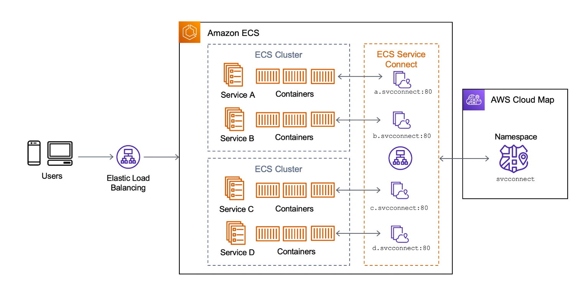

Service Connect 는 ECS 클러스터 내부의 분산된 서비스 간의 연결을 손쉽게 구축하고 운영할 수 있는 새로운 기능 입니다.  
애플리케이션 코드를 직접 변경하지 않으면서 서비스 간 통신을 위한 회복 탄력성(resilience)있는 네트워크 계층을 추가하여 트래픽의 헬스 체크와 요청 실패시 자동 재시도와 같은 기능을 쉽게 적용할 수 았고,   
트래픽의 텔레메트리 데이터에 대한 인사이트도 Amazon CloudWatch 와 ECS 콘솔을 통해 얻을 수 있습니다.

 

## Business Challenge
최근 회사에서 운영중인 서비스 스택을 Bahrain 리전에서 UAE 리전 으로 마이그레이션 해야 하는 작업이 있었습니다.   
UAE 리전에 프로비저닝을 하기전에 UAE 리전에 관한 제약 사항들을 조사하였고 주요 항목은 다음과 같습니다.    
- AWS 에서 현재까지 UAE 리전은 사용가능한 리전이 아니므로, 리전 목록에서 활성화를 해줘야 합니다.   
- Ahtena 를 정식으로 지원하지 않습니다.
- ECS Service Discovery 를 위한 CloudMap 의 Namespace 를 지원하지 않습니다.
- 그 밖에 [Service Connect 고려 사항](https://docs.aws.amazon.com/AmazonECS/latest/developerguide/service-connect.html#service-connect-considerations) 을 주의깊에 살펴보아야 합니다.

다행히, [2023년 7월](https://aws.amazon.com/ko/about-aws/whats-new/2023/06/amazon-athena-aws-middle-east-uae-region/) 부터 Athena 서비스가 정식 지원이 되었습니다.  

하지만, 우리의 서비스는 다수의 ECS Fargate 서비스로 구성되어 서로 인터페이스 하게 되어 있고, 내부적으로 CloudMap 의 Namespace 를 사용하도록 구성되었는데 이 부분은 여전히 지원 되지 않았기 때문에 가장 적합한 대체 서비스를 찾아야 했습니다. 

조사를 통해 [2022년 AWS ReInvent](https://youtu.be/1_YUmq3MpYQ?t=945) 에서 소개된 ECS Service Connect 를 사용하여 서비스간 인터페이스를 구성하고, CloudMap 을 이용한 HPPT_NAMESPACE 방식의 Service Discovery 를 사용하는 방법을 확인할 수 있었고 이를 통해 UAE 리전에 서비스를 구성할 수 있었습니다.

### AWS ECS Service Connect 의 개요

AWS [ECS (Amazon Elastic Container Service) Service Connect](https://docs.aws.amazon.com/AmazonECS/latest/developerguide/service-connect.html) 는 
Amazon ECS 서비스와 다른 AWS ECS 서비스와의 연결성을 개선하는 기능입니다. 
이 기능은 컨테이너화된 애플리케이션과 다른 AWS 리소스 간의 통신을 보다 쉽게 설정하고 관리할 수 있도록 지원합니다.

### ECS Service Connect의 주요 기능 및 장점

ECS Service Connect는 다음과 같은 주요 기능을 제공합니다:

| 기능                | 설명                                                                                                                                                                             |
|:------------------|:-------------------------------------------------------------------------------------------------------------------------------------------------------------------------------|
| 서비스 간 통신 간소화    | ECS Service Connect를 사용하면 서비스 간 통신을 간소화할 수 있습니다. 기존에는 서비스 간에 통신하기 위해 수동으로 VPC 피어링, 로드 밸런서, NAT 게이트웨이 등을 설정해야 했지만, ECS Service Connect를 사용하면 보다 쉽고 간편하게 서비스 간에 통신을 구축할 수 있습니다.  |
| 서비스 간 통신 보안 강화 | ECS Service Connect는 AWS PrivateLink를 기반으로 하여 서비스 간의 통신을 보안적으로 격리할 수 있습니다. 통신은 AWS 내부 네트워크를 통해 이루어지므로 인터넷을 통과하지 않고 내부적으로만 통신하게 됩니다.                                            |
| 서비스 간 통신의 단순화  | ECS Service Connect를 사용하면 VPC 간 피어링 설정과 같은 복잡한 네트워킹 구성을 피할 수 있습니다. 이를 통해 개발자는 서비스 간 통신에 집중하고 간단한 설정으로 서비스 간 통신을 구축할 수 있습니다.                                                    |
| 뛰어난 네트워크 성능    | ECS Service Connect는 AWS PrivateLink를 사용하여 높은 네트워크 성능을 제공합니다. 이는 인터넷 대역폭에 의존하지 않고 안정적이고 빠른 서비스 간 통신을 가능하게 합니다.                                                                 |

ECS Service Connect는 컨테이너화된 애플리케이션의 네트워크 통신을 단순화하고 보안을 강화하여 AWS 리소스 간의 통신을 편리하게 관리할 수 있도록 지원합니다. 이를 통해 애플리케이션 배포 및 관리를 향상시킬 수 있습니다.

 

## Service Connect 프로비저닝 흐름

1. 콘솔에서 Service Connect 설정을 업데이트하면, Amazon ECS Agent를 통해 Service Connect Agent 컨테이너 설정이 주입됩니다.
2. Amazon ECS Agent는 Service Connect Agent를 생성하고, 애플리케이션 컨테이너를 배포하기 위한 명령을 내립니다.
3. ECS 노드 인스턴스에는 먼저 Service Connect Agent 가 생성되며, 추가로 필요한 컨테이너(e.g., pause 컨테이너) 등이 배포됩니다. 그리고 Service Connect 관련 환경 설정이 완료되면 애플리케이션 컨테이너가 생성됩니다.
4. 이때 Amazon ECS는 AWS Cloud Map의 HTTP_NAMESPACE 에서 미리 등록된 서비스들의 디스커버리 정보를 가져옵니다.
5. 가져온 최신 서비스 디스커버리 정보는 내부 통신을 위해 Service Connect Agent에 설정됩니다.
6. cats-api가 정상적으로 배포되면, cats-api의 Service Connect 관련 정보도 AWS Cloud Map 에 업데이트됩니다.

 

## Service Connect Request 흐름

위 그림은 Client - ELB - Frontend - Backkend API 서비스간 Service Connect 를 통해 Service-Mesh 를 구성하고, 그 내부에서 이루어지는 요청 흐름을 보여줍니다. 

1. 인터넷 사용자 또는 외부 클라이언트는 도메인을 통해 서비스를 액세스 하며, 도메인에 대한 타겟인 ELB 로 전달 됩니다.
2. ELB 의 listener 포트 또는 path 경로를 통해 ECS Frontend 서비스로 전달됩니다. 
3. ECS Frontend 서비스 진입에서 Service Connect Agent 는 요청 정보를 식별하고, ECS 컨테이너 내부에서 관리하는 서비스 디스커버리 정보인 Service Name 를 통해 요청을 전달합니다.
4. Frontend Service Connect Agent 는 ECS Frontend 서비스가 요청하는 Backend API 를 식별하고 Service Name 으로 ECS Backend 서비스를 연결합니다. 
5. Backend 서비스 진입에서 Service Connect Agent 는 요청 정보를 식별하고, ECS 컨테이너 내부에서 관리하는 서비스 디스커버리 정보인 Service Name 를 통해 요청을 전달합니다. 
6. Backend Service Connect Agent 는 ECS Backend 서비스의 응답 결과를 Frontend Service Connect Agent 로 전달합니다.

 

## ECS Service Connect 설정하기

Service Connect 의 네임스페이스는 HTTP_NAMESPACE 로 설정 됩니다. 이는 Service Name 을 식별할 때 DNS 네임 해석을 하지 않는다는 것입니다. 그리고 Service Discovery 항목은 설정되지 않은 것을 확인할 수 있습니다.

 

Service Connect 를 구성할 때 현재 ECS 서비스가 다른 서비스로부터 호출되는 서비스라면 `Client and Server` 를 선택합니다.
`Client and Server` 방식은 Service Connect Agent 가 요청을 받아들이고, 요청을 전달할 서비스를 식별하기 위해 Service Name 을 사용한다는 것을 의미합니다.

|            |                                                                                                                    | 
|------------|--------------------------------------------------------------------------------------------------------------------|
| Port alias | Service Connect Agent 가 요청을 받아들이는 포트를 의미합니다. 컨테이너의 이름 입니다.                                                       |
| Discovery  | Service Connect Agent 가 요청을 전달할 서비스를 식별하기 위해 사용하는 서비스 디스커버리 정보를 의미합니다. Service Discovery 의 Service Name 으로 매핑 됩니다. |
| DNS | Service Connect Agent 가 요청을 전달할 서비스를 식별하기 위해 사용하는 DNS 네임을 의미합니다.  |

Port alias 는 Service Connect Agent 가 요청을 받아들이는 포트를 의미합니다. 
Discovery 는 Service Connect Agent 가 요청을 전달할 서비스를 식별하기 위해 사용하는 서비스 디스커버리 정보를 의미합니다.
DNS 는 Service Connect Agent 가 요청을 전달할 서비스를 식별하기 위해 사용하는 DNS 네임을 의미합니다.

## ECS Task Definition에서 ECS Service Connect 구성하기
### 네트워크 구성 및 연결 설정
### 환경 변수 및 구성 파일 설정

## ECS Service Connect 사용 사례
### 마이크로서비스 간의 안전한 통신 구축
### 서비스 간 종속성 관리 및 효율적인 개발

## ECS Service Connect 관리 및 모니터링
### 연결된 서비스 관리 및 수정하기
### 서비스 연결 상태 모니터링 및 문제 해결

## 보안 및 베스트 프랙티스
### ECS Service Connect의 보안 기능 및 권장 사항
### Best Practice: 네트워크 구성, 권한 관리, 보안 그룹 등

## 결론

AWS ECS Service Connect를 통해 구축된 안전하고 확장 가능한 마이크로서비스 환경의 장점
ECS Service Connect를 사용하여 애플리케이션 통합과 관리를 간소화하는 방법에 대한 요약
이러한 구조를 기반으로 AWS ECS Service Connect에 대한 자세한 내용을 블로그에 작성하실 수 있습니다. 각 섹션에서는 해당 주제에 대한 상세한 내용을 설명하고 예시, 팁, 리소스 등을 추가하여 독자가 쉽게 이해하고 활용할 수 있도록 구성하는 것이 좋습니다.
