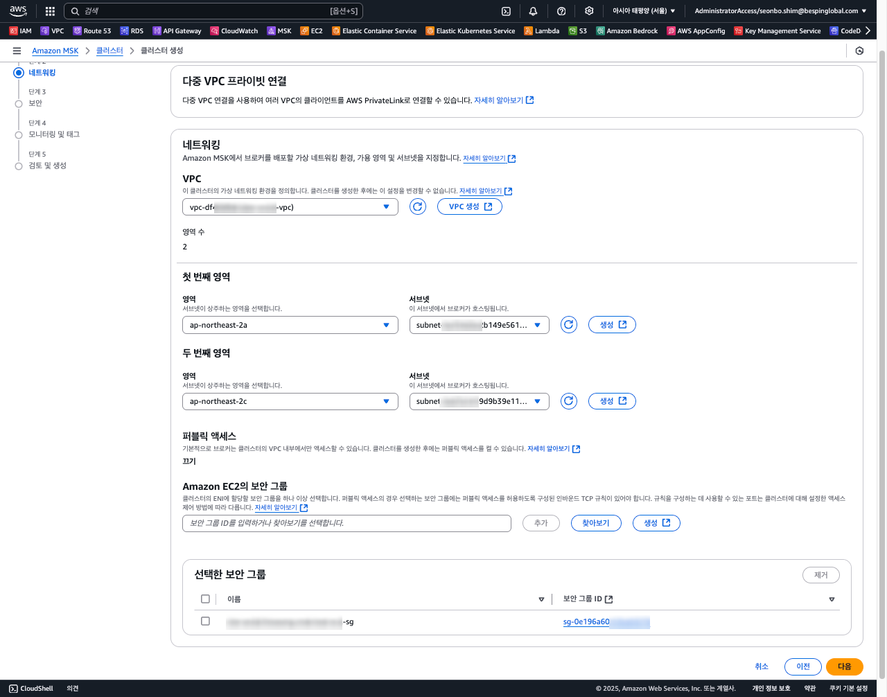
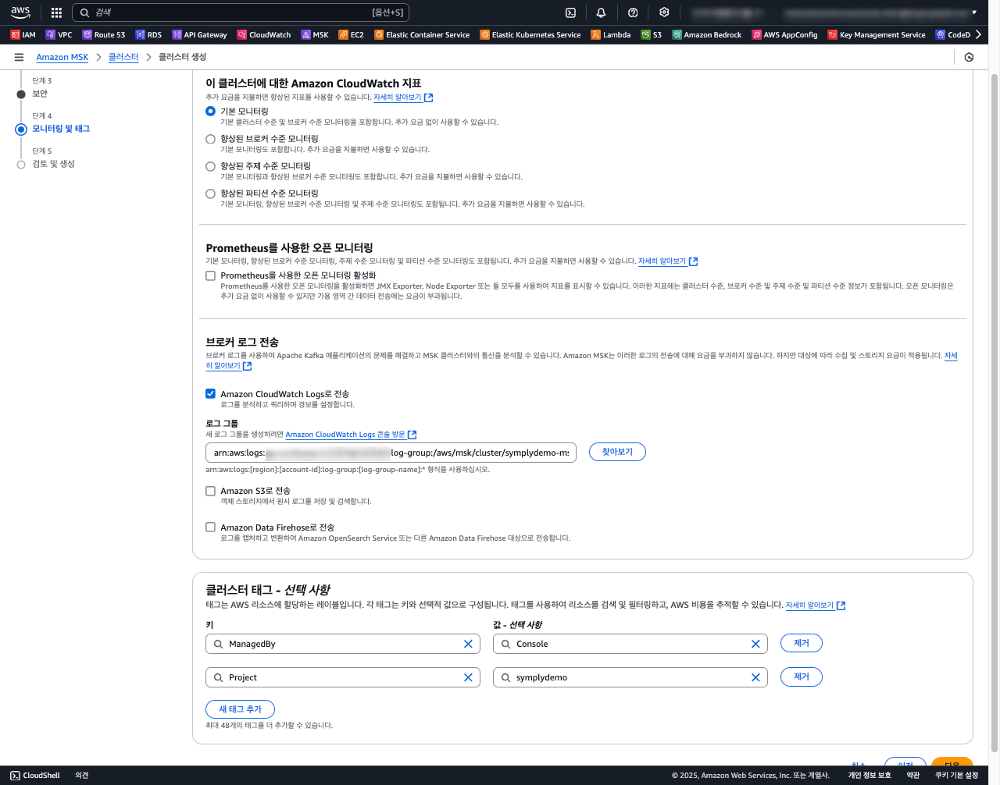
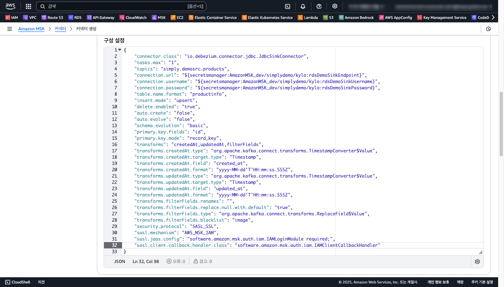

## AWS MSK CDC 구현의 배경

AWS Aurora RDS의 몇몇 데이터베이스 테이블에 대해 동기화를 AWS DMS 서비스를 이용하고 있습니다. 
AWS DMS는 실시간 데이터 마이그레이션 및 복제를 간소화하는 데 매우 유용하지만, 마이그레이션 유형이 동일한 패턴이라고 하더라도 DMS Source, Target, Task 를 하나의 번들로 구성해야 합니다.
DMS Task 별 생성해야 할 관련 리소스가 많고 갯수가 많아지면 비용 및 운영 부담이 생길 수 밖에 없습니다. 

`Amazon MSK`가 실시간 데이터 스트림을 지원하고 특히 CDC(Change Data Capture) 관련 오픈소스인 [Debezium](https://debezium.io/) 있으므로 이 패턴을 일관된 프로세스로 마이그레이션을 적용해 보았습니다.


## Amazon MSK?

Amazon Managed Streaming for Apache Kafka(Amazon MSK)는 Apache Kafka를 완전 관리형으로 제공하여 실시간 데이터 스트리밍 애플리케이션을 쉽게 구축하고 운영할 수 있게 해줍니다. 
이를 통해 클러스터의 프로비저닝, 구성, 유지 관리 등의 작업을 AWS에서 처리하므로 개발자는 애플리케이션 개발에 집중할 수 있습니다. 
특히 Amazon MSK는 엔터프라이즈급 보안 기능과 고가용성을 제공하여 안정적인 데이터 스트리밍 환경을 구축할 수 있습니다.


### Amazon MSK의 주요 특징
- 완전 관리형 서비스: 클러스터 생성, 확장, 유지 관리, 보안 설정 등 Apache Kafka의 운영 부담을 AWS에서 담당합니다.
- 높은 가용성: 다중 AZ(Avalibility Zone) 배포 및 자동 복구를 통한 안정성을 제공합니다.
- 보안 기능 제공: IAM, VPC 통합, TLS 암호화를 통한 보안 강화합니다
- 서버리스 옵션: 워크로드 규모에 따라 서버리스를 통해 확장-축소가 가능합니다.

### Amazon MSK의 활용 범위
- 실시간 데이터 처리: 데이터 ETL 처리 등 실시간 분석을 위한 데이터 파이프라인 생성하여 처리를 간편하게게 하고 운영을 자동화할수 있습니다.
- 중앙 집중식 데이터 버스: 분산 시스템 간 데이터 통합과 메시징 허브로 활용합니다.
- 로그 및 이벤트 스트림 수집: 애플리케이션 로그, IoT 데이터 등을 실시간으로 수집할 수 있습니다.

## Amazon MSK 클러스터 설정하기

Amazon MSK 클러스터의 핵심 구성 요소는 하나 이상의 브로커로 구성되며, 브로커 노드의 크기와 수는 애플리케이션 워크로드에 따라 설정합니다.

브로커를 포함한 주요 컴포넌트와 특징은 아래와 같습니다. 


### 브로커 (Brokers)
브로커는 Kafka 클러스터의 핵심 요소로, 메시지를 저장하고 클라이언트(Producer/Consumer)와 통신하는 역할을 합니다.
브로커 고가용성을 위해 다중 AZ 배포를 권고 합니다. 각 브로커는 사용자가 생성한 토픽에 메시지 데이터를 저장하며, 리더 브로커와 팔로워 브로커로 역할을 분담 합니다.

#### 주의사항
- 브로커 수를 늘리면 Kafka의 파티션 리더와 팔로워 복제본이 여러 브로커에 분산되므로, 부하 분산이 개선됩니다.
- 브로커 수를 줄이거나 리소스를 낮추는 경우, 성능 저하 및 데이터 재분배에 오히려 비용이 발생할 수 있습니다.


### 파티션 (Partitions)
클라이언트는 특정 브로커에 Topic을 대상으로 메시지를 Produce / Consume 합니다. Topic의 메시지는 물리적으로 여러 파티션에 분산되어 저장됩니다. 
그러므로 파티션 수는 클러스터의 병렬 처리량과 성능에 직접적으로 영향을 주게됩니다.
Kafka 데이터 분산처리 메커니즘의 핵심은 데이터를 저장할 때 리더 파티션에서 읽고 쓰며, 팔로워 파티션에 복제된다는 점입니다.


#### 주의사항
- 파티션 수가 적으면 클러스터의 처리량이 제한될 수 있습니다.
- 파티션 수를 늘리면 리소스 사용량이 증가하므로 적정 값을 설정해야 합니다.

### 리플리케이션 팩터 (Replication Factor)
데이터의 고가용성과 복원력을 보장하기 위한 토픽의 파티션을 복제하는 복제본의 수 입니다. 
각 파티션에는 하나의 리더와 여러 팔로워 복제본이 생성됩니다. 리플리케이션 팩터가 높을수록 데이터 복원성이 향상되는 반면 스토리지와 네트워크 비용이 증가합니다. 
따라서 안정성을 위해 복제본을 3개 이상 설정하기를 권고하지만 비용 절감을 위해 2개로 지정할 수 있습니다.

- ISR (In-Sync Replica): 현재 리더와 동기화된 복제본.

#### 주의사항
- 리플리케이션 팩터는 브로커 수보다 클 수 없습니다.
- 적절한 리플리케이션 팩터 설정으로 데이터 손실과 성능 저하를 방지할 수 있습니다. 


### MSK 보안을 위한 접근 제어 (Access Control) 구성

Amazon MSK는 다음과 같은 네 가지 접근 제어 방법을 제공합니다

- Unauthenticated Access: 별도의 인증 없이 모든 클라이언트가 클러스터에 접근할 수 있는 방법으로, 주로 내부 네트워크에서만 사용됩니다.
- IAM Role-Based Authentication: AWS Identity and Access Management(IAM)를 사용하여 MSK 클러스터에 대한 인증과 권한 부여를 처리합니다.
- SASL/SCRAM Authentication: 사용자 이름과 비밀번호를 사용하여 인증을 제공하는 메커니즘으로, 암호화된 챌린지-응답 방식을 통해 보안을 강화합니다. SCRAM은 비밀번호를 해시하고 솔트값을 추가하여 저장 및 전송 중 보안을 유지하며, 네트워크에서 비밀번호 스니핑 및 사전 공격을 방지합니다. 또한 AWS Secrets Manager를 통해 자격 증명을 안전하게 저장하고 관리합니다.
- TLS Client Authentication through AWS Certificate Manager (ACM): TLS를 사용하여 클라이언트와 MSK 브로커 간의 보안 연결을 설정하며, AWS Private CA를 통한 인증서를 필요로 합니다.

#### 접근 제어 유형별 엔드포인트 포트 번호
| Authentication type   | Port  |
|-----------------------|-------|
| Plaintext             | 9092  |
| IAM                   | 9098  |
| SASL/SCRAM            | 9096  |
| TLS                   | 9094  |

보다 강화된 보안 환경에서 안전한 클라이언트 접근을 위해 `IAM` 및 `SASL/SCRAM` 액세스 컨트롤을 선택하는것을 권고합니다. 

`SASL/SCRAM Authentication` 방식에서 클라이언트 설정은 대게 다음과 같습니다. 

[client.properties]
```properties
security.protocol=SASL_SSL
sasl.mechanism=AWS_MSK_IAM 
sasl.jaas.config=software.amazon.msk.auth.iam.IAMLoginModule required; 
sasl.client.callback.handler.class=software.amazon.msk.auth.iam.IAMClientCallbackHandler
```


### 모니터링 및 로깅
CloudWatch 로그 및 메트릭의 구성은 클러스터의 상태와 성능을 지속적으로 확인할 뿐만 아니라, Broker의 스케일을 컨트롤할 수 있으므로 설정하는것을 권고 합니다. 

- CloudWatch Logs: Kafka 브로커의 운영 로그를 수집합니다.
- CloudWatch Metrics: 브로커, 토픽, 파티션의 성능과 리소스 사용량 모니터링합니다.

#### 주의사항
- MSK 과부하나 병목 현상을 확인하기 위해 CloudWatch Metric을 통한 모니터링을 강화할 수 있습니다.
- MSK 토픽의 로그 세그먼트 주기(log.retention.ms)와 크기 설정으로 저장 비용 최적화할 수 있습니다.


## MSK 커넥터를 활용한 CDC 구현 

MSK 클러스터를 구성하고 MSK Connector 를 통한 CDC 구현을 본격적으로 진행해 봅니다. 


### 데이터베이스 구성

PoC를 위한 Source 및 Target 테이터베이스를 구성합니다. 소스 테이블 `demosrc.products`를 타겟 테이블 `demosink.productinfo` 으로 Sink 하는 Use-Case 를 Debezium 오픈소스로 구현합니다.

[schema.sql](aws-msk-cdc-schema.sql) 을 참조하여 데이터베이스 및 테이블을 구성 합니다.


### VPC 구성


### MSK 클러스터 구성 

먼저 MSK 클러스터를 구성하기 위한 VPC 구성도입니다. MSK 클러스터 유형은 serverless 와 provisioned 모드 2가지로 구분되는데, 여기서는 브로커 수와 브로커당 스토리지 양을 사용자가 지정할 수 있는 provisioned 모드로 구성합니다. 

여기선 PoC 를 위한 `3.6.0` 버전의 `Zookeeper` 모드에서 `kafka.t3.small` 개발 모드의 인스턴스로 구성해봅니다.


- 클러스터 기본 정보 


- 네트워킹

MSK 클러스터를 위한 VPC 서브넷 및 보안 그룹을 설정 합니다.




- 보안 

클라이언트 인증 방식을 결정하고, TLS 암호화 및 Topic 에 저장되는 데이터 암호화를 위한 KMS 키를 설정합니다. 


- 모니터링 및 태그

CloudWatch 로그 그룹을 `/aws/msk/cluster/{MSK_CLUSTER_NAME}` 형식으로 사전에 만들어 둡니다.



* 최종적으로 입력한 구성 정보를 `검토` 하고 MSK 클러스터를 생성 합니다. 


### MSK 클러스터 참고

Apache Kafka 엔진 버전 또한 Zookeeper 와 Kraft 모드 두가지로 나뉘는데 간략하게 특징 및 장단점은 아래와 같습니다.


### Zookeeper vs KRaft 비교
Kafka의 전통적인 방식으로, Zookeeper가 클러스터 메타데이터(브로커 상태, 토픽 구성, ACL 등)를 관리합니다.
반면에, KRaft는 Kafka 2.8.0 이후 도입된 새로운 방식으로, Zookeeper 없이 Kafka 자체적으로 메타데이터를 관리합니다.


| 특징      | Zookeeper                | KRaft                                  |
|----------|--------------------------|----------------------------------------|
| 안정성    | 안정적이고 검증된 방식         | 신기술로 안정성은 Zookeeper 비해 상대적으로 부족 |
| 운영효율성  | Zookeeper 관리 필요        | 단일 시스템으로 간소화                       |
| 확장성     | 제한적 (Zookeeper 병목 가능) | 향상된 확장성 (Raft 기반)                  |
| 호환성     | 기존 도구 및 워크플로와 호환    | 일부 도구 호환성 제한                      |
| 미래성     | EOS 대체 가능성 있음         | Kafka의 미래 표준                        |


MSK 커넥터를 구성하기 전에, 로컬 환경에 Kafka Debezium 커넥터를 구성하고,
지금 배포된 MSK 클러스터 중간에 배치 하여 Source / Target 시스템간 데이터를 동기화 하는
간단한 PoC로 빠르게 기능을 검정해 봅시다. 


## PoC 기능 검증 아키텍처

[파이프라인 아키텍처 이미지]


## Kafka 커넥터 기능 구현

다음과 같은 절차로 빠르게 로컬 환경을 구성하고, 기능을 확인 합니다. 

- 데이터베이스 스키마와 기초데이터를 구성
- docker-compose 으로 mysql8 및 debezium-connect 컨테이너 구성
- AWS MKS 클러스터의 브로커와 통신 검증 
- Source 커넥터 배포 및 상태 확인  
- AWS MKS 토픽 조회 및 Source 스키마 `demosrc.products`의 메시지 포멧 확인
- Sink 커넥터 배포 및 상태 확인
- Target 스키마 `demosink.productinfo` 데이터 Sink 확인 

### 데이터베이스 스키마 구성 

위 시나리오 구현을위해 MySQL 데이터베이스에서  단순하게 `demosrc.products` 스키마의 데이터를 `demosink.productinfo` 스키마로 적재하는 기능을 구현합니다. 


두 개의 스키마는 서로 다른 데이터베이스에 있으며 image 칼럼이 Target 스키마엔 존재하지 않습니다. 

- [init.sql](../assets/archive/aws-msk-connector-demo-schema.sql) 스키마 참고


### docker-compose 로컬 런타임 환경 구성

docker-compose 를 통해 로컬 환경에 mysql 와 debezium 커넥터를 위한 컨테이너를 구성합니다. 


- [docker-compose.yaml] 설정 파일 예시

```yaml
---
services:

  mysqlsvc:
    image: mysql/mysql-server:8.0
    container_name: mysqlsvc
    hostname: mysqlsvc
    ports:
      - 3306:3306
    environment:
      - MYSQL_ROOT_PASSWORD=changeme1234
    healthcheck: { test: mysql -pchangeme1234 -e 'select 1', interval: 5s, start_period: 100s }
    volumes:
      - ./mysql/mysql.cnf:/etc/mysql/conf.d
      - ./mysql/init.sql:/docker-entrypoint-initdb.d/init.sql
    networks:
      - simplydemo

  connect:
    image: quay.io/debezium/connect:2.7.3.Final
    container_name: connect
    ports:
      - 8083:8083
    healthcheck: { test: curl -f localhost:8083, interval: 20s, start_period: 100s }
    environment:
      # Kafka Connect 기본 설정
      - BOOTSTRAP_SERVERS=<YOUR_MSK_BROKER_ENDPOINT:9098>
      - GROUP_ID=MyConnector
      - CONFIG_STORAGE_TOPIC=connect-configs
      - OFFSET_STORAGE_TOPIC=connect-offsets
      - STATUS_STORAGE_TOPIC=connect-status
      - KEY_CONVERTER=org.apache.kafka.connect.json.JsonConverter
      - VALUE_CONVERTER=org.apache.kafka.connect.json.JsonConverter
      - OFFSET_FLUSH_INTERVAL_MS=60000
      - CONNECT_REST_ADVERTISED_HOST_NAME=connect
      - CONNECT_REST_PORT=8083
      # IAM 인증 설정
      - AWS_PROFILE=${AWS_PROFILE}
      - AWS_SHARED_CREDENTIALS_FILE=/kafka/.aws/credentials
      - CONNECT_SECURITY_PROTOCOL=SASL_SSL
      - CONNECT_SASL_MECHANISM=AWS_MSK_IAM
      - CONNECT_SASL_JAAS_CONFIG=software.amazon.msk.auth.iam.IAMLoginModule required;
      - CONNECT_SASL_CLIENT_CALLBACK_HANDLER_CLASS=software.amazon.msk.auth.iam.IAMClientCallbackHandler
      # 플러그인 경로
      - CONNECT_PLUGIN_PATH=/kafka/connect
      - CLASSPATH=/kafka/connect/debezium-plugins/*:/kafka/connect/debezium-connector-mysql/*
    volumes:
      - ~/.aws:/kafka/.aws:ro
      - ./connect/plugins:/kafka/connect/debezium-plugins:ro
    depends_on:
      mysqlsvc: { condition: service_healthy }
    networks:
      - simplydemo

networks:
  simplydemo:
    name: simplydemo
```

#### 주요 속성 정보

- AWS_PROFILE : AWS MKS 클러스터 및 SecretsManager 액세스 권한이 있는 AWS_PROFILE 환경 변수를 지정 합니다.    
- BOOTSTRAP_SERVERS : MSK 클러스터를 대상으로 클라이언트가 액세스 할 수 있는 BROKER Endpoint 를 기입합니다. IAM 인증인 경우 9098 포트에 대한 Endpoint 를 기입 하세요.    
- CLASSPATH : Kafka 커텍터가 참조하는 Java 라이브라리 경로입니다. debezium 관련 jar 및 SASL_JAAS 인증에 필요한 [aws-msk-iam-auth](https://github.com/aws/aws-msk-iam-auth/releases) 라이프러리가 위치한 경로를 지정 합니다.  
  CLASSPATH 의 라이브러리를 인식할 수 있도록 `./connect/plugins:/kafka/connect/debezium-plugins:ro` 옵션으로 HOST 의 볼륨을 공유 하세요.


- mysqlsvc 컨테이너용 볼륨을 마운트: mysql 데이터베이스 설정 `mysql.cnf` 과 `init.sql` 초기 스키마를 구성하는 스크립트를 위한 HOST 파일시스템을 마운트합니다.

```
    volumes:
      - ./mysql/mysql.cnf:/etc/mysql/conf.d
      - ./mysql/init.sql:/docker-entrypoint-initdb.d/init.sql
```

- `mysql.cnf` 및 [init.sql](../assets/archive/aws-msk-connector-demo-schema.sql) 스키마 예시

```
[client]
port=3306
default-character-set = utf8mb4

[mysqld]
bind-address            = 0.0.0.0
port                    = 3306
server-id               = 1
binlog_format           = row
log-bin                 = mysql-bin
character-set-server    = utf8mb4
collation-server        = utf8mb4_unicode_ci
lower_case_table_names  = 1
```

- connect 컨테이너용 볼륨을 마운트: AWS_PROFILE 프로파일을 통한 IAM 인증과, Debezium Connector 가 Java 라이브러리를 인식할 수 있도록 HOST 파일시스템을 마운트합니다.
```
    volumes:
      - ~/.aws:/kafka/.aws:ro
      - ./connect/plugins:/kafka/connect/debezium-plugins:ro
```

#### simplydemo docker-compose 구동

`docker-compose up -d` 명령으로 백그라운드 모드로 실행하고 아래와 같이 STATUS 상태가 Up 인지 확인합니다.


docker 컨테이너를 구동하기전에 반드시 AWS 클라우드를 액세스할 수 있는 AWS_PROFILE 환경 변수를 설정하세요.

`export AWS_PROFILE=<YOUR_AWS_PROFILE>`


### AWS MKS 클러스터의 브로커와 연결 확인

- [KafkaIAMConnectTest] 샘플 코드 

```java
public class KafkaIAMConnectTest {
    // BOOTSTRAP_SERVERS 브로커 주소를 설정하세요
    private static final String BOOTSTRAP_SERVERS = "your.mskbroker1.kafka.awsregion.amazonaws.com:9098, ...";

    private static HashMap<String, Object> getStringObjectHashMap() {
        HashMap<String, Object> props = new HashMap<>();
        props.put(AdminClientConfig.BOOTSTRAP_SERVERS_CONFIG, BOOTSTRAP_SERVERS);
        // IAM 인증 설정
        props.put(CommonClientConfigs.SECURITY_PROTOCOL_CONFIG, "SASL_SSL");
        props.put(SaslConfigs.SASL_MECHANISM, "AWS_MSK_IAM");
        props.put(SaslConfigs.SASL_JAAS_CONFIG, "software.amazon.msk.auth.iam.IAMLoginModule required;");
        props.put(SaslConfigs.SASL_CLIENT_CALLBACK_HANDLER_CLASS, "software.amazon.msk.auth.iam.IAMClientCallbackHandler");
        return props;
    }

    public void createTopic() {
        HashMap<String, Object> props = getStringObjectHashMap();
        final NewTopic newTopic = new NewTopic(KafakaClientAuth.TOPIC, 1, (short) 1);
        try (final AdminClient adminClient = AdminClient.create(props)) {
            adminClient.createTopics(Collections.singleton(newTopic)).all().get();
            System.out.println("Topic created successfully");
        } catch (InterruptedException | ExecutionException e) {
            System.out.println(e.getMessage());
        }
    }

    public static void main(String[] args) {
        new KafkaIAMConnectTest().createTopic();
    }
}
```

위와 같이 로컬에서 KafkaIAMConnectTest 파일을 실행했을 때 `Topic created successfully`가 정상적으로 나온다면 `SASL_SSL` 방식으로 연결이 됩니다. 

MSK 클러스터를 AWS VPC의 Private 네트워크에 배포했다면 로컬 PC가 사전에 VPN과 같이 네트워크 연결이 사전에 구성 되어 있어야 가능합니다.


### Source 커넥터 배포 및 상태 확인

Kafka 커넥터는 플러그인으로 아무런 코드 구현 없이 설정만으로 동작합니다.

- [source-connector-demosrc.json] 소스 커넥터 설정 파일 예시 

```config
{
  "name": "source-connector-demosrc",
  "config": {
    # debezium 커넥터 정보 입니다.
    "connector.class": "io.debezium.connector.mysql.MySqlConnector",
    "tasks.max": "1",    
    "bootstrap.servers": "<AWS_MSK_IAM_BROKE_BOOTSTRAP_SERVERS:9098>",
    
    # 데이터 소스 연결 정보 입니다.
    "database.hostname": "mysqlsvc",
    "database.port": "3306",
    "database.user": "kfc",
    "database.password": "kfc1234",
    "database.server.id": "76311378",
    "database.server.name": "simplydemo",
    "topic.creation.enable": "true",
    "topic.prefix": "simply",
    "database.include.list": "demosrc",
    "table.include.list": "demosrc.products",
    
    # 커넥터 성능 정보 입니다. 
    "reconnect.backoff.ms": "100000",
    "producer.request.timeout.ms": "60000",
    "producer.retry.backoff.ms": "100000",
    "producer.reconnect.backoff.ms": "100000",
    
    # Producer용 SASL_SSL 정보  
    "producer.override.security.protocol": "SASL_SSL",
    "producer.override.sasl.mechanism": "AWS_MSK_IAM",
    "producer.override.sasl.jaas.config": "software.amazon.msk.auth.iam.IAMLoginModule required;",
    "producer.override.sasl.client.callback.handler.class": "software.amazon.msk.auth.iam.IAMClientCallbackHandler",
    
    # ConnectorTask용 SASL_SSL 정보  
    "schema.history.internal.kafka.bootstrap.servers": "<AWS_MSK_IAM_BROKE_BOOTSTRAP_SERVERS:9098>",
    "schema.history.internal.kafka.topic": "history.schema-changes",
    "schema.history.internal.producer.security.protocol": "SASL_SSL",
    "schema.history.internal.producer.sasl.mechanism": "AWS_MSK_IAM",
    "schema.history.internal.producer.sasl.jaas.config": "software.amazon.msk.auth.iam.IAMLoginModule required;",
    "schema.history.internal.producer.sasl.client.callback.handler.class": "software.amazon.msk.auth.iam.IAMClientCallbackHandler",
    "schema.history.internal.consumer.security.protocol": "SASL_SSL",
    "schema.history.internal.consumer.sasl.mechanism": "AWS_MSK_IAM",
    "schema.history.internal.consumer.sasl.jaas.config": "software.amazon.msk.auth.iam.IAMLoginModule required;",
    "schema.history.internal.consumer.sasl.client.callback.handler.class": "software.amazon.msk.auth.iam.IAMClientCallbackHandler",
    
    # Topic 및 메시지용 정보
    "key.converter": "org.apache.kafka.connect.json.JsonConverter",
    "value.converter": "org.apache.kafka.connect.json.JsonConverter",
    "snapshot.mode": "initial",
    "time.precision.mode": "connect",
    "decimal.handling.mode": "double",
    "auto.create": "false",
    "auto.evolve": "false",
    "delete.enabled": "true"
  }
}

```

위 설정에서 7개의 주요 설정 영역 기준으로 설정하였습니다. 아래는 각 영역에 대한 주요 속성이며 이 값들은 여러분의 Use-Case 에 맞게 조정 하세요.

- debezium 커넥터: debezium 은 다양한 데이터소스 커넥터를 제공하고 있습니다. 여기서는 `io.debezium.connector.mysql.MySqlConnector` 커넥터를 사용합니다. 
- 데이터 소스 연결 정보: 소스 데이터베이스를 대상으로 데이터를 가져오기 위한 인증 및 연결 정보를 구성합니다.  
- 소스 데이터베이스 연결 정보: 데이터 소스를 읽어 오기위한 인증 및 연결 정보를 구성합니다.  
- 커넥터 성능 정보 : MSK 클러스터의 컴퓨팅 성능은 처리량에 영향을 주게 되므로 timeout 및 backoff 관련 옵션을 적절하게 조정해야 합니다.
- Producer용 SASL_SSL 정보 : 기본 Producer Connector가 MSK 브로커와 SASL_SSL 보안 연결을 하기 위한 설정 정보입니다.
- ConnectorTask용 SASL_SSL 정보 : MySqlConnector가 Source 및 Sink 작업 수행용 SASL_SSL 보안 연결을 하기 위한 설정 정보입니다.
- Topic 및 메시지용 정보: 메시지 변환, payload, schema 메시지 및 Topic 의 offset 관련 설정 정보입니다.


#### source-connector 배포
로컬의 connect 컨테이너는 8083 포트로 서비스하고 있으므로 RESTFul API를 아래와 같이 간단하게 호출하는것 만으로 배포가 됩니다. 

```
curl -X POST 'http://localhost:8083/connectors' -H 'Content-Type: application/json' -d @source-connector-demosrc.json
```

#### source-connector 상태 확인 

`source-connector-demosrc` 이름으로 커넥터 상태를 아래와 같이 확인 할 수 있습니다. 응답 메시지의 `state` 속성이 `RUNNING` 이여야 합니다.  
```
curl http://localhost:8083/connectors/source-connector-demosrc/status

{"name":"source-connector-demosrc","connector":{"state":"RUNNING","worker_id":"192.168.192.3:8083"},"tasks":[{"id":0,"state":"RUNNING","worker_id":"192.168.192.3:8083"}],"type":"source"}%     
```

#### source-connector 제거 

커넥터 설정 정보 오류로 재배포가 필요하거나, 더이상 사용하지 않으면 불필요한 커넥터를 제거할 수 있습니다. 

```
curl -X DELETE http://localhost:8083/connectors/source-connector-demosrc
```

### Source 커넥터 동작 확인

- kafka-topics.sh 명령으로 MSK 클러스터에 생성된 Topic 현황을 확인 합니다. 

```
kafka-topics.sh --list --bootstrap-server $BOOTSTRAP_SERVERS --command-config client.properties
__amazon_msk_canary
__consumer_offsets
__debezium-heartbeat.simply
connect-configs
connect-offsets
connect-status
history.schema-changes
simply
simply.demosrc.products
```

- Topic 메시지 확인

`kafka-console-consumer.sh` 명령을 통해 `simply.demosrc.product` 토픽에 저장된 메시지를 Consume 할 수 있습니다.  

```
kafka-console-consumer.sh --topic simply.demosrc.products --from-beginning \
  --bootstrap-server $BOOTSTRAP_SERVERS --consumer.config client.properties
```

```json
{"schema":{"type":"struct","fields":[{"type":"struct","fields":[{"type":"int64","optional":false,"field":"id"},{"type":"string","optional":true,"field":"name"},{"type":"string","optional":true,"field":"description"},{"type":"string","optional":true,"field":"category"},{"type":"float","optional":true,"field":"price"},{"type":"string","optional":true,"field":"image"},{"type":"string","optional":true,"name":"io.debezium.time.ZonedTimestamp","version":1,"field":"created_at"},{"type":"string","optional":true,"name":"io.debezium.time.ZonedTimestamp","version":1,"field":"updated_at"}],"optional":true,"name":"simply.demosrc.products.Value","field":"before"},{"type":"struct","fields":[{"type":"int64","optional":false,"field":"id"},{"type":"string","optional":true,"field":"name"},{"type":"string","optional":true,"field":"description"},{"type":"string","optional":true,"field":"category"},{"type":"float","optional":true,"field":"price"},{"type":"string","optional":true,"field":"image"},{"type":"string","optional":true,"name":"io.debezium.time.ZonedTimestamp","version":1,"field":"created_at"},{"type":"string","optional":true,"name":"io.debezium.time.ZonedTimestamp","version":1,"field":"updated_at"}],"optional":true,"name":"simply.demosrc.products.Value","field":"after"},{"type":"struct","fields":[{"type":"string","optional":false,"field":"version"},{"type":"string","optional":false,"field":"connector"},{"type":"string","optional":false,"field":"name"},{"type":"int64","optional":false,"field":"ts_ms"},{"type":"string","optional":true,"name":"io.debezium.data.Enum","version":1,"parameters":{"allowed":"true,first,first_in_data_collection,last_in_data_collection,last,false,incremental"},"default":"false","field":"snapshot"},{"type":"string","optional":false,"field":"db"},{"type":"string","optional":true,"field":"sequence"},{"type":"int64","optional":true,"field":"ts_us"},{"type":"int64","optional":true,"field":"ts_ns"},{"type":"string","optional":true,"field":"table"},{"type":"int64","optional":false,"field":"server_id"},{"type":"string","optional":true,"field":"gtid"},{"type":"string","optional":false,"field":"file"},{"type":"int64","optional":false,"field":"pos"},{"type":"int32","optional":false,"field":"row"},{"type":"int64","optional":true,"field":"thread"},{"type":"string","optional":true,"field":"query"}],"optional":false,"name":"io.debezium.connector.mysql.Source","field":"source"},{"type":"struct","fields":[{"type":"string","optional":false,"field":"id"},{"type":"int64","optional":false,"field":"total_order"},{"type":"int64","optional":false,"field":"data_collection_order"}],"optional":true,"name":"event.block","version":1,"field":"transaction"},{"type":"string","optional":false,"field":"op"},{"type":"int64","optional":true,"field":"ts_ms"},{"type":"int64","optional":true,"field":"ts_us"},{"type":"int64","optional":true,"field":"ts_ns"}],"optional":false,"name":"simply.demosrc.products.Envelope","version":2},"payload":{"before":null,"after":{"id":8,"name":"Coffee Maker","description":"Brew the perfect cup of coffee every time","category":"Home Appliances","price":99.99,"image":"https://example.com/images/coffeemaker.jpg","created_at":"2025-02-12T10:10:04Z","updated_at":"2025-02-12T10:10:04Z"},"source":{"version":"2.7.3.Final","connector":"mysql","name":"simply","ts_ms":1739381500000,"snapshot":"true","db":"demosrc","sequence":null,"ts_us":1739381500000000,"ts_ns":1739381500000000000,"table":"products","server_id":0,"gtid":null,"file":"binlog.000002","pos":157,"row":0,"thread":null,"query":null},"transaction":null,"op":"r","ts_ms":1739381500972,"ts_us":1739381500972608,"ts_ns":1739381500972608564}}
``` 

메시지 구조는 크게 `schema` 와 `payload` 로 구분되면 테이블 스키마 정보 및 변경 사항, 테이블 데이터의 정보 및 변경사항을 담고 있습니다.

CDC 메시지 캡쳐에 대해 상세한 내용은 [Debezium connector for MySQL](https://debezium.io/documentation/reference/stable/connectors/mysql.html) 에서 확인할 수 있습니다.


### Sink 커넥터 배포 및 상태 확인

- [sink-connector-productinfo.json] Sink 커넥터 설정 파일 예시

```
{
  "name": "sink-connector-productinfo",
  "config": {
    # debezium 커넥터
    "connector.class": "io.debezium.connector.jdbc.JdbcSinkConnector",
    "tasks.max": "1",
    
    # 데이터 소스 참조 토픽  
    "topics": "simply.demosrc.products",
    
    # Sink 대상 데이터베이스 
    "connection.url": "jdbc:mysql://mysqlsvc:3306/demosink",
    "connection.username": "sinko",
    "connection.password": "sinko1234",
    
    # Sink 마이그레이션 모드 
    "table.name.format": "productinfo",
    "insert.mode": "upsert",
    "delete.enabled": true,
    "auto.create": false,
    "auto.evolve": false,
    "schema.evolution": "basic",
    "primary.key.fields": "id",
    "primary.key.mode": "record_key",

    # 칼럼 데이터 변환 및 드랍
    "transforms": "createdAt,updatedAt,filterFields",
    "transforms.createdAt.type": "org.apache.kafka.connect.transforms.TimestampConverter$Value",
    "transforms.createdAt.target.type": "Timestamp",
    "transforms.createdAt.field": "created_at",
    "transforms.createdAt.format": "yyyy-MM-dd'T'HH:mm:ss.SSSZ",
    "transforms.updatedAt.type": "org.apache.kafka.connect.transforms.TimestampConverter$Value",
    "transforms.updatedAt.target.type": "Timestamp",
    "transforms.updatedAt.field": "updated_at",
    "transforms.updatedAt.format": "yyyy-MM-dd'T'HH:mm:ss.SSSZ",
    "transforms.filterFields.renames": "",
    "transforms.filterFields.replace.null.with.default": true,
    "transforms.filterFields.type": "org.apache.kafka.connect.transforms.ReplaceField$Value",
    "transforms.filterFields.blacklist": "image",
    
    # Consumer용 SASL_SSL 정보  
    "consumer.override.security.protocol": "SASL_SSL",
    "consumer.override.sasl.mechanism": "AWS_MSK_IAM",
    "consumer.override.sasl.jaas.config": "software.amazon.msk.auth.iam.IAMLoginModule required;",
    "consumer.override.sasl.client.callback.handler.class": "software.amazon.msk.auth.iam.IAMClientCallbackHandler"
  }
}       
```

위 설정에서 6개의 주요 영역 기준으로 설정하였습니다. 각 영역에 대한 주요 속성과 값들은 여러분의 Use-Case 에 맞게 조정 하세요.

- debezium 커넥터: debezium 은 다양한 데이터 Sink 커넥터를 제공하고 있습니다. 여기서는 `io.debezium.connector.jdbc.JdbcSinkConnector` 커넥터를 사용합니다.
- 데이터 소스 참조 토픽: 소스 데이터가 위치하는 Topic 을 설정합니다.
- Sink 대상 데이터베이스: 데이터를 적재할 대상 데이터베이스의 연결 정보입니다.  
- Sink 마이그레이션 모드: 대상 테이블은 무엇인지, 트랜잭션 데이터만 포함할 것인지 스키마도 포함할 것인지, CUD 모든 트랜잭션을 지원할 것인지 등을 설정합니다.  
- 칼럼 데이터 변환 및 드랍 : Sink 대상 테이블 칼럼에 맞게 변환하고 없는 칼럼인경우 Drop 하는등 전반적인 변환에 대해 설정합니다.
- Consumer용 SASL_SSL 정보 : Topic 메시지를 읽어오기 위해 SASL_SSL 프로토콜용 인증 정보를 설정합니다.


#### Sink-connector 배포

로컬의 connect 컨테이너는 8083 포트로 서비스하고 있으므로 RESTFul API를 아래와 같이 간단하게 호출하는것 만으로 배포가 됩니다.

```
curl -X POST 'http://localhost:8083/connectors' -H 'Content-Type: application/json' -d @connect/sink-connector-productinfo.json
```

#### Sink-connector 상태 확인

`sink-connector-productinfo` 이름으로 커넥터 상태를 아래와 같이 확인 할 수 있습니다. 응답 메시지의 `state` 속성이 `RUNNING` 이여야 합니다.
```
curl http://localhost:8083/connectors/sink-connector-productinfo/status

{"name":"sink-connector-productinfo","connector":{"state":"RUNNING","worker_id":"192.168.192.3:8083"},"tasks":[{"id":0,"state":"RUNNING","worker_id":"192.168.192.3:8083"}],"type":"sink"}%     
```

#### Sink-connector 제거

커넥터 설정 정보 오류로 재배포가 필요하거나, 더이상 사용하지 않으면 불필요한 커넥터를 제거할 수 있습니다.

```
curl -X DELETE http://localhost:8083/connectors/sink-connector-productinfo
```

### Sink 커넥터 동작 확인

- MySQL 데이터 베이스에 접속하여 `demosrc.products` 데이터 소스로부터 `demosink.productinfo` 타겟 스키마에 데이터가 sink 되는지 확인합니다.  

```
docker exec -it mysqlsvc /bin/bash

mysql -u sinko -psinko1234 -D demosink

select * from productinfo;
```


여기까지 로컬 환경에서 AWS MSK 클러스터를 대상으로 외부 시스템의 RDS 데이터를 또 다른 외부 시스템의 RDS 으로 동기화 하는 한가지 Pipeline 을 구현해 보았습니다. 

이어서 AWS Cloud 에 MSK 커넥터를 배포합니다. 
 

## MSK 커넥터 아키텍처


### 커텍터를 통한 데이터 파이프라인 컨셉

Kafka 커넥터는 데이터를 처리하기 위해 코드를 전혀 작성하지 않고도 다양한 데이터 소스의 데이터를 및 싱크 시스템과 통합할 수 있도록 해주는 플러그인 컴포넌트입니다.

데이터소스 유형은 RDS, NoSQL, Dataware-Hourse, S3, FileSystem 심지어 RESTFul API를 대상으로 할 수 있습니다.

커넥터는 데이터를 대상에 전달을 위해 데이터 타입 및 값을 변환하거나 데이터 필터링과 같은 간단한 로직을 수행할 수도 있습니다.


위 그림은 End-To-End 간 둘 간의 시스템을 하나의 파이프라인으로 데이터가 전달하는 것처럼 보입니다.

잘 살펴보면 중간에 있는 Topic 을 중심으로, 첫번째 과정으로 Source 커넥터가 원천 데이터의 유입을 담당하고, 두번째로 Sink 커텍터가 타겟 시스템으로 데이터를 전송하는 것을 알 수 있습니다.

EAI, ESB 와 같은 시스템간 통합을 커넥터를 이용 하게되면 설정만으로 너무나 간단하게 데이터 통합을 구현해 내게 됩니다.


### MSK Plugin 구성


MSK Plugin은 Kafka Connect 프레임워크의 확장으로, 특정 데이터 소스나 싱크와 Kafka 간의 데이터 이동을 담당합니다.

특히, [debezium](https://debezium.io/)과 같이 CDC(Change Data Capture) 오픈소스는 사용자에게 커넥터를 보다 쉽게 구성하도록 도와 줍니다.

MySQL 용 MSK Source Connector plugin 구성을 위해 [debezium-connector-mysql-2.7](https://debezium.io/releases/2.7) 버전을 다운로드 받아서 플러그인을 만들어 S3 버킷에 업로드 합니다.

[msk-config-providers](https://github.com/aws-samples/msk-config-providers) 라이브러리는 Kafka 커넥터에서 secretsmanager, ssm, s3import 관련 Credentials 셋트를 편리하게 참조할 수 있으므로 플러그인에 추가합니다. 
 

- debezium-connector-mysql-2.7.3.Final.zip 소스 커넥터 플러그인 구성 절차 예시 

```
curl -O https://repo1.maven.org/maven2/io/debezium/debezium-connector-mysql/2.7.3.Final/debezium-connector-mysql-2.7.3.Final-plugin.tar.gz
tar -xvzf debezium-connector-mysql-2.7.3.Final-plugin.tar.gz
cd debezium-connector-mysql

# You should add this `msk-config-providers` for accessing Secrets Keys  
curl -L -O https://github.com/aws-samples/msk-config-providers/releases/download/r0.3.1/msk-config-providers-0.3.1-all.jar

zip -9 ../debezium-connector-mysql-2.7.3.Final.zip *
```

`debezium-connector-mysql-2.7.3.Final.zip` 소스커넥터 플러그인을 본인의 S3 버킷에 업로드 합니다. 

<br>

MySQL 용 MSK Sink Connector plugin 구성을 위해 [debezium-connector-jdbc-2.7](https://debezium.io/releases/2.7) 버전을 다운로드 받아서 플러그인을 만들어 S3 버킷에 업로드 합니다.

- debezium-connector-jdbc-2.7.3.Final.zip 소스 커넥터 플러그인 구성 절차 예시

```
curl -O https://repo1.maven.org/maven2/io/debezium/debezium-connector-jdbc/2.7.3.Final/debezium-connector-jdbc-2.7.3.Final-plugin.tar.gz
tar -xvzf debezium-connector-jdbc-2.7.3.Final-plugin.tar.gz
cd debezium-connector-jdbc

# You should add this `msk-config-providers` for accessing Secrets Keys  
curl -L -O https://github.com/aws-samples/msk-config-providers/releases/download/r0.3.1/msk-config-providers-0.3.1-all.jar

zip -9 ../debezium-connector-jdbc-2.7.3.Final.zip *
```

`debezium-connector-jdbc-2.7.3.Final.zip` 싱크커넥터 플러그인을 본인의 S3 버킷에 업로드 합니다.


### MSK Worker 속성 구성

MSK Worker는 플러그인을 로드하고 데이터 이동 처리를 주관하는 커넥터용 컴퓨팅 인스턴스입니다.

MSK Worker 커넥터가 생성될 때 미리 정의된 공통 속성을 참조하여 일관되고 자동화된 운영을 돕습니다.     


- worker.properties

```properties
# Converter
key.converter=org.apache.kafka.connect.json.JsonConverter
key.converter.schemas.enable=true
value.converter=org.apache.kafka.connect.json.JsonConverter
value.converter.schemas.enable=true

# Secrets Values
config.providers=secretsmanager
config.providers.secretsmanager.class=com.amazonaws.kafka.config.providers.SecretsManagerConfigProvider
config.providers.secretsmanager.param.region=ap-northeast-2

# Worker Instance
task.shutdown.graceful.timeout.ms=10000
offset.flush.interval.ms=10000
offset.flush.timeout.ms=5000
```

- Worker 설정에 정의한 secretsmanager 제공자는 MSK가 액세스하는 시크릿 키에 대해 사용자 편의를 제공합니다.    
아래는 `AmazonMSK_dev/simplydemo/kylo` 시크릿 키에서 `kfc.password`, `sinko.password` 를 참조하는 예시입니다.
```
kfc.password = ${secretsmanager:AmazonMSK_dev/simplydemo/kylo:kfc.password}
sinko.password = ${secretsmanager:AmazonMSK_dev/simplydemo/kylo:sinko.password}
${secretManager:MySecret-1234:dbusername}
```

- Kafka Connector 에 대한 속성 및 역할은 [Kafka Connector Configs](https://kafka.apache.org/documentation/#connectconfigs) 를 참고할 수 있으며, AWS MKS 에서는 보안 및 관리를 목적으로 제한한 속성들이 다수 있습니다.    


### MSK Connector 준비 

MSK Connector 는 크게 Source Connector 와 Sink Connector 로 구분 합니다.  

`Connector`를 구성하기 위해서는 아래와 같이 VPC, MSK 클러스터 및 IAM Role 등 사전에 구성되어야 할 리소스가 있습니다.  

- VPC : IGW, NAT 게이트웨이가 포함된 `VPC`가 사전에 구성되어야 합니다.  
- Subnets  : Connector 가 배포될 서브넷으로 개발 환경은 최소 2개, 운영 환경은 최소 3 개 이상을 권고합니다. 
- MSK 클러스터 : Managed Kafka 커넥터를 생성하는 경우 MSK 클러스터 구성에서 사용된 VPC, Subnets, Security Group 과 연결 됩니다.    
- KMS : Secrets Key 컬렉션을 암호화 할 때 사용되는 KMS 키입니다.
- SecretsManager : Secrets Key 컬렉션을 구성합니다. Key 이름은 `AmazonMSK_` 접두어로 생성해야만 MSK 커텍터가 참조 할 수 있습니다.
- CloudWatch LogGroup : /aws/msk/connector/simplydemo-mks-demosrc-connector
- IAM Role : [IAM roles and policies](https://docs.aws.amazon.com/msk/latest/developerguide/msk-connect-iam.html) 를 참고하여 Connector 역할을 생성합니다.
  (참고로, MKS, S3, SecretsManager, KMS, Cloudwatch 등의 액세스 권한이 필요합니다.)


### MSK Source Connector 구성

AWS 관리 콘솔을 통해 주요 5가지 단계를 거쳐서 Source 커넥터가 구성됩니다. 여기선 8 개의 섹션으로 구성해 보았습니다.  

STEP 1 - 사용자 지정 플러그인 


STEP 2 - 커넥터 기본 정보


STEP 3 - 커넥터 속성 


STEP 4 - 커넥터 용량


STEP 5 - Kafka 커넥터 버전 및 액세스 권한
 


STEP 6 - 보안


STEP 7 - 로그 및 태그 


STEP 8 - 검토 및 생성


### MSK Sink Connector 구성

Connector 를 구성하는 과정은 Sink 를 위한 `커넥터 속성`만 크게 차이가 나며 나머지 과정은 생략 합니다. 

STEP 1 - 사용자 지정 플러그인


STEP 2 - 커넥터 속성



STEP 3 - 검토 및 생성 


```
{
  "connector.class": "io.debezium.connector.mysql.MySqlConnector",
  "tasks.max": "1",
  "database.hostname": "${secretsmanager:AmazonMSK_dev/simplydemo/kylo:rdsDemoSrcEndpoint}",
  "database.port": "3306",
  "database.user": "${secretsmanager:AmazonMSK_dev/simplydemo/kylo:rdsDemoSrcUsername}",
  "database.password": "${secretsmanager:AmazonMSK_dev/simplydemo/kylo:rdsDemoSrcPassword}",
  "database.server.id": "76311378",
  "database.include.list": "demosrc",
  "database.allowPublicKeyRetrieval": "true",
  "table.include.list": "demosrc.products",
  "topic.prefix": "simply",
  "schema.history.internal.kafka.topic": "history.schema-changes",
  "schema.history.internal.kafka.bootstrap.servers": "${secretsmanager:AmazonMSK_dev/simplydemo/kylo:bootstrapServers}",
  "schema.history.internal.consumer.security.protocol": "SASL_SSL",
  "schema.history.internal.consumer.sasl.mechanism": "AWS_MSK_IAM",
  "schema.history.internal.consumer.sasl.jaas.config": "software.amazon.msk.auth.iam.IAMLoginModule required;",
  "schema.history.internal.consumer.sasl.client.callback.handler.class": "software.amazon.msk.auth.iam.IAMClientCallbackHandler",
  "schema.history.internal.producer.security.protocol": "SASL_SSL",
  "schema.history.internal.producer.sasl.mechanism": "AWS_MSK_IAM",
  "schema.history.internal.producer.sasl.jaas.config": "software.amazon.msk.auth.iam.IAMLoginModule required;",
  "schema.history.internal.producer.sasl.client.callback.handler.class": "software.amazon.msk.auth.iam.IAMClientCallbackHandler",
  "include.schema.changes": "true",
  "snapshot.mode": "initial",
  "time.precision.mode": "connect",
  "heartbeat.interval.ms": "2000",
  "snapshot.locking.mode": "none",
  "skipped.operations": "none",
  "quote.identifiers": "always",
  "decimal.handling.mode": "double",
  "auto.create": "false",
  "auto.evolve": "false",
  "delete.enabled": "true"
}
```


<div class="code-container">
  <div class="code-header" onclick="toggleCode('code1')">
    펼치기/접기: simplydemo-msk-sink-connector-productinfo
  </div>
  <div id="code1" class="code-content">
```
{
    "connector.class": "io.debezium.connector.jdbc.JdbcSinkConnector",
    "tasks.max": "1",
    "topics": "simply.demosrc.products",
    "connection.url": "${secretsmanager:AmazonMSK_dev/simplydemo/kylo:rdsDemoSinkEndpoint}",
    "connection.username": "${secretsmanager:AmazonMSK_dev/simplydemo/kylo:rdsDemoSinkUsername}",
    "connection.password": "${secretsmanager:AmazonMSK_dev/simplydemo/kylo:rdsDemoSinkPassword}",
    "table.name.format": "productinfo",
    "insert.mode": "upsert",
    "delete.enabled": "true",
    "auto.create": "false",
    "auto.evolve": "false",
    "schema.evolution": "basic",
    "primary.key.fields": "id",
    "primary.key.mode": "record_key",
    "transforms": "createdAt,updatedAt,filterFields",
    "transforms.createdAt.type": "org.apache.kafka.connect.transforms.TimestampConverter$Value",
    "transforms.createdAt.target.type": "Timestamp",
    "transforms.createdAt.field": "created_at",
    "transforms.createdAt.format": "yyyy-MM-dd'T'HH:mm:ss.SSSZ",
    "transforms.updatedAt.type": "org.apache.kafka.connect.transforms.TimestampConverter$Value",
    "transforms.updatedAt.target.type": "Timestamp",
    "transforms.updatedAt.field": "updated_at",
    "transforms.updatedAt.format": "yyyy-MM-dd'T'HH:mm:ss.SSSZ",
    "transforms.filterFields.renames": "",
    "transforms.filterFields.replace.null.with.default": "true",
    "transforms.filterFields.type": "org.apache.kafka.connect.transforms.ReplaceField$Value",
    "transforms.filterFields.blacklist": "image",
    "security.protocol": "SASL_SSL",
    "sasl.mechanism": "AWS_MSK_IAM",
    "sasl.jaas.config": "software.amazon.msk.auth.iam.IAMLoginModule required;",
    "sasl.client.callback.handler.class": "software.amazon.msk.auth.iam.IAMClientCallbackHandler"
}
```
  </div>
</div>


#### 참고 사항 
- KRaft 모드는 `3.7.x` 버전 이상에서만 가능하며 특히 개발 환경에 사용되는 `T` 타입의 인스턴스를 사용할 수 없습니다. 
- KRaft 모드의 Express 


### 운영 시 주의사항
워크로드 규모에 대응하는 클러스터 크기를 결정해야 합니다. 과도한 리소스는 비용을 증가시키고, 너무 낮은 리소스 스펙은 프로비저닝 성능 저하를 초래합니다.

리플리케이션 팩터와 데이터의 크기는 네트워크 및 스토리지 비용에 영향을 미침.
필요한 복제본 이상으로 설정하지 않도록 주의.
데이터 손실 방지

ISR 상태 확인으로 파티션 복제가 정상적으로 이루어지는지 모니터링.
로그 유지 설정(log.retention.ms)을 적절히 조정하여 오래된 데이터를 관리.
보안 관리

Kafka 브로커와 클라이언트 간 암호화 및 인증 설정 테스트.
IAM 역할을 최소 권한 원칙으로 설정하여 보안 위험 줄이기.


[Amazon Managed Streaming for Apache Kafka - 개발자 가이드](https://docs.aws.amazon.com/ko_kr/msk/latest/developerguide/MSKDevGuide.pdf)