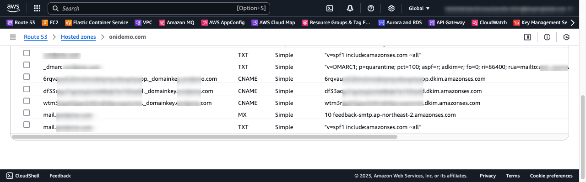

# AWS SES 구성 및 DMARC 설정 으로 이메일 보안을 강화  

## DMARC 구성 배경

최근 특정 도메인에 대해 `DMARC` 정책 누락 또는 정책 무시로 인해 리포팅이 보고된 적이 있습니다. 이런 유형의 보안 정책을 보완할 때마다 이전에 구성한 정보를 반복적으로 추적하고 확인하는데 
이번 기회에 `Route53`서비스의 Hosted Zone 과 `SES 샌드박스` 구성 부터 SES 도메인 Identity, MX 레코드, DKIM, SPF 정책 까지 단계별로 정리하고자 합니다.


## AWS SES?
[AWS SES(Simple Email Service)](https://aws.amazon.com/ko/ses/)는 이메일 발송 및 관리에 최적화된 클라우드 서비스입니다. 

처음 SES를 사용할 때는 샌드박스 환경에서 이메일 발송 제한이 있으므로, 운영환경을 위해 본격적으로 사용하려면 구체적인 구성을 통해 운영 환경으로 전환해야 합니다.


## Route53 도메인 호스팅 구성하기

SES 샌드박스를 구성하려면, 먼저 AWS Route53에서 도메인을 호스팅하고, DNS를 관리할 수 있도록 설정합니다.

AWS 관리 콘솔에 로그인하여 Route53 서비스의 "Hosted Zones" 메뉴에서 Public Hosted Zone 도메인을 추가합니다.

- Public Hosted Zone 추가 


- Public Hosted Zone 정보 확인 


Public Hosted Zone 구성을 완료 하면, `Hosted zone name`, `Hosted zone ID`, 도메인 권한 시작을 알리는 `SOA`, 도메인 네임서버 권한을 어떤 Name Server 들이 가지는지 `NS` 레코드를 확인할 수 있습니다.

#### SOA (Start of Authority)
SOA 레코드는 네임서버가 해당 도메인에 관하여 인증된 데이터를 가지고 있음을 증명하는 레코드입니다.   
SOA 레코드는 도메인당 오직 1개만 설정되며, 기본 이름 서버, 도메인 관리자의 전자 메일, 도메인 일련 번호 및 영역 새로 고침과 관련된 여러 타이머를 포함하여 DNS 영역에 대한 핵심 정보를 가집니다. 

#### NS (Name-Server)  
NS 레코드는 도메인 이름 해석을 하는 네임 서버의 권한을 어떤 도메인이 관리 하고 있는지 알려주는 레코드 입니다.


## SES 샌드박스 구성 하기

AWS SES 서비스는 각 리전에 대해 기본적으로 샌드박스 모드로 구성되어 있으며, 제한된 이메일 발송 권한만 제공합니다.


`Get set up` 에서 보듯 기본으로 구성된 SendBox 는 이메일 발송 제한이 있으며, `Open Tasks`를 통해 주요 구성 정보를 설정 및 확인할 수 있습니다. 

### SES Set Up

SES SendBox 구성은 `도메인 Identity` 를 시작으로 아래 주요 단계를 거쳤을 때 비로소 이메일을 발송할 준비가 됩니다. 


## 도메인 Identity 생성 및 DNS 검증

도메인 이메일 발송 신뢰성을 높이기 위해 SES에 도메인 `Identity`를 등록하고 `Route53`에서 검증할 수 있도록 관련 레코드를 추가합니다.


### MX 레코드 추가

DMARC 피드백 리포트를 받기 위해 `use custom MAIL FROM domain`을 체크하고, MX 레코드를 입력합니다. 


MX 레코드는 `mail`, 또는 `mx` 와 같은 도메인 접두어를 추천합니다.

### DKIM 설정

DKIM(DomainKeys Identified Mail)은 이메일 위조 방지 및 신뢰성 확인을 위한 인증 방식입니다. 
`이메일 발송자(AWS SES)`가 자신의 도메인에 대해 비밀 키(private key)로 이메일의 특정 부분(헤더, 본문 등)을 서명하고,
`메일 수신자(Receiving Mail Server)`가 도메인의 공개 키(public key)를 DNS에 등록된 DKIM 레코드를 통해 검증하는 방식으로 작동합니다.

다음은 도메인 검증 방식의 DKIM 구성의 주요 설정 정보 입니다. `Easy DKIM`, `RSA 암호화 방식`, `DKIM signatures` 등을 체크합니다.  
- 참고로 Route53 DNS 레코드 자동추가 옵션은 별도 관리를 위해 체크하지 않았습니다.  


`Identity 생성`을 완료 하면 Route53 Public Hosted zone (예: example.org)을 위한 SES 보안용 DKIM, MX, SPF, DMARC 관련 레코드를 확인할 수 있습니다. 


## 이메일 인증 관련 보안 프로토콜 이해

오랫동안 `DKIM`, `SPF`, `DMARC`는 강력히 권장되었지만 필수는 아니었습니다. 하지만 2024년 부터는 대량의 SMTP 발신자라면 이 세 가지 인증 방법을 모두 사용해야 합니다.

여기서는 `SPF`및 `DKIM`정책을 적용하고, `DMARC`를 통해 회사가 이메일 보안을 개선하고 도메인 평판을 보호할 수 있도록 설정합니다.


### DKIM 정책

DKIM(DomainKeys Identified Mail)은 이메일이 전송되는 동안 변조되지 않았음을 보증하기 위해 도메인 소유자가 메일에 디지털 서명을 추가하는 이메일 인증 기술입니다.

#### DKIM 동작 방식의 이해 

SES 샌드 박스를 통해 발송되는 시나리오 에서, 발송자 FROM 정보가 `no.reply@example.org` 이고, 수신자 `Rcpt-TO`가 `customer@honmail.com`인 경우 DKIM 에 대한 요청 및 검증 흐름은 다음과 같습니다. 


이메일 발송 요청 시 FROM 주소에 `no.reply@example.org`이 지정 되고, SES 샌드박스는 발송자의 도메인(예: `example.org`)이 사전에 검증되어 메일 전송 전에 DKIM 서명(비밀 키)을 메일 헤더에 추가합니다.  
`example.org` 도메인에 대해 미리 생성된 `DKIM`용 사설 키(private key)와 공개 키(public key)가 존재하며, 공개 키는 DNS에 TXT 레코드 형태로 등록되어 있으므로 `메일 수신자(Receiving Mail Server)`는 FROM 발송자 도메인의 DKIM Public Key를 조회하여 아래의 주요 단계로 검증 합니다.

1. DNS 조회: 수신 메일 서버는 이메일의 DKIM-Signature 헤더에 포함된 도메인을 기반으로 해당 도메인의 DNS에서 공개 키를 조회합니다.
2. 서명 확인: 조회된 공개 키를 사용하여, 메일의 서명 부분과 메일의 실제 내용(헤더, 본문 등)을 비교합니다.
3. 검증 결과: 만약 해싱 결과와 서명 값이 일치하면, 이메일이 도메인 소유자에 의해 인증되었다고 판단하며, 일치하지 않으면 위조 가능성이 있다고 간주됩니다.
- `메일 수신자(Receiving Mail Server)`는 서명이 올바르게 검증 되면, 해당 이메일이 `example.org` 도메인에서 변조 없이 발송되었음을 확인하고 그렇지 않으면 SPAM 등 위조 가능성이 있다고 판단 합니다.


#### DKIM TXT 레코드 주요 속성 참고 

```
NAME                                TYPE    VALUE
_6rqvauxp._domainkey.example.org    TXT     "v=DKIM1; k=rsa; p=MIIyrwIDAQAB***"
```

<table>
<thead>
<tr>
    <td>속성</td>
    <td>설명</td>
    <td>예시</td>
</tr>
</thead>
<tbody>
<tr>
    <td>v</td> 
    <td>DKIM 버전: DKIM 사양의 버전을 나타냅니다. 현재는 항상 "DKIM1"이어야 하며, DKIM 레코드가 올바른 형식을 갖추었음을 의미합니다.</td>
    <td>v=DKIM1;</td>
</tr>
<tr>
    <td>k</td> 
    <td>키 유형: 사용된 암호화 알고리즘을 지정합니다. 대부분의 경우 "rsa"를 사용하며, 일부 환경에서는 다른 알고리즘(예: ed25519)이 사용될 수 있습니다.</td>
    <td>k=rsa;</td>
</tr>
<tr>
    <td>p</td> 
    <td>공개 키: Base64로 인코딩된 공개 키 값입니다. 수신자가 이 값을 DNS에서 조회하여, 이메일에 포함된 DKIM 서명을 검증하는 데 사용합니다. (중요: 키 값이 길어 여러 줄로 나뉠 수 있으나, DNS에는 하나의 연속된 문자열로 저장됩니다.)</td>
    <td>p=MIGfMA0GCSqGSIb3DQEB...</td>
</tr>
<tr>
    <td>t</td> 
    <td>테스트 플래그: 선택적 속성으로, "y" 값이 설정되면 이 DKIM 키가 테스트용임을 나타냅니다. 테스트 환경에서는 실제 운영 키와 다르게 동작할 수 있음을 알리기 위한 용도도 옵션입니다.</td>
    <td>t=y; (Optional)</td>
</tr>
<tr>
    <td>g</td> 
    <td>Granularity: 선택적 속성으로, DKIM 키가 적용되는 로컬 파트(이메일 주소의 '@' 앞부분)를 제한할 수 있습니다. 일반적으로 "*"를 사용하여 모든 로컬 파트에 대해 유효함을 명시합니다.</td>
    <td>g=*; (Optional)</td>
</tr>
<tr>
    <td>x</td> 
    <td>만료 시간: 선택적 속성으로, 유닉스 타임스탬프 형태로 DKIM 키의 만료 시점을 지정합니다. 설정할 경우, 해당 시간 이후에는 이 키를 더 이상 사용하지 않음을 의미합니다.</td>
    <td>x=1618884473; (Optional)</td>
</tr>
</tbody>
</table>


### SPF 정책

SPF(Sender Policy Framework) 정책은 도메인 소유자가 해당 도메인에서 메일을 발송할 수 있는 SMTP 메일 서버를 DNS에 명시함으로써, 스푸핑(위조) 및 불법 메일 발송을 방지하는 역할을 합니다.


#### SPF 동작 방식의 이해

SES 샌드 박스를 통해 발송되는 시나리오 에서, 발송자 FROM 정보가 `no.reply@example.org`이고, 수신자 `Rcpt-TO`가 `customer@honmail.com`인 경우 SPF 에 대한 요청 및 검증 흐름은 다음과 같습니다.


이메일 수신 서버(Receiving Mail)는 MAIL FROM 이메일 발송 도메인 `example.org`에 대해 TXT 레코드를 조회하여 SPF 정책을 확인합니다.   
`example.org` 도메인에 대해 `v=spf1 ip4:192.0.2.0/24 include:amazonses.com ~all`와 같이 SPF 정책이 설정되었다고 가정하면,  
수신 서버(Receiving Mail)는 `192.0.2.0/24` 대역 또는 `amazonses.com` 도메인에 대한 SMTP Sender 인지 검증합니다.     

- 수신 서버(Receiving Mail)는 SPF 레코드의 각 메커니즘(include, ip4, ip6, a, mx 등)과 qualifier(+, -, ~, ?)를 분석하여 MAIL FROM 이메일 발송 도메인의 `SMTP Sender` IP 주소가 SPF 레코드에 정의된 조건과 일치하는지 확인합니다.


- 참고로, dig 와 같은 명령어로 `amazonses.com` 도메인의 TXT 레코드를 확인하면 SPF 정책에 대한 SMTP Sender IP 들을 확인할 수 있습니다.

```
dig TXT amazonses.com

; <<>> DiG 9.10.6 <<>> TXT amazonses.com

;amazonses.com.			IN	TXT

;; ANSWER SECTION:
amazonses.com.		900	IN	TXT	"v=spf1 ip4:199.255.192.0/22 ip4:199.127.232.0/22 ip4:54.240.0.0/18 ip4:69.169.224.0/20 ip4:23.249.208.0/20 ip4:23.251.224.0/19 ip4:76.223.176.0/20 ip4:54.240.64.0/19 ip4:54.240.96.0/19 ip4:76.223.128.0/19 ip4:216.221.160.0/19 ip4:206.55.144.0/20 -all"

```


#### SPF TXT 레코드 주요 속성 참고

```
NAME           TYPE    VALUE
example.org    TXT     "v=spf1 ip4:192.0.2.0/24 include:amazonses.com ~all"
```


<table>
<thead>
<tr>
    <td>속성</td>
    <td>설명</td>
    <td>예시</td>
</tr>
</thead>
<tbody>
 <tr>
      <td>v</td>
      <td>SPF 버전을 지정합니다. 현재 SPF 레코드는 항상 "v=spf1"로 시작하며, 해당 레코드가 SPF 정책임을 나타냅니다.</td>
      <td>v=spf1</td>
    </tr>
    <tr>
      <td>ip4</td>
      <td>도메인에서 발송을 허용하는 IPv4 주소 또는 주소 범위를 지정합니다.</td>
      <td>ip4:192.0.2.0/24</td>
    </tr>
    <tr>
      <td>ip6</td>
      <td>도메인에서 발송을 허용하는 IPv6 주소 또는 주소 범위를 지정합니다.</td>
      <td>ip6:2001:db8::/32</td>
    </tr>
    <tr>
      <td>a</td>
      <td>도메인의 A 레코드(IP 주소)를 기준으로 발송을 허용합니다. 선택적으로 다른 도메인을 지정할 수도 있습니다.</td>
      <td>a 또는 a:example.org</td>
    </tr>
    <tr>
      <td>mx</td>
      <td>도메인의 MX 레코드에 명시된 메일 서버의 IP 주소를 기반으로 발송을 허용합니다.</td>
      <td>mx 또는 mx:example.org</td>
    </tr>
    <tr>
      <td>include</td>
      <td>다른 도메인의 SPF 정책을 포함하여 해당 도메인의 허용 목록을 참조합니다.</td>
      <td>include:_spf.google.com</td>
    </tr>
    <tr>
      <td>exists</td>
      <td>특정 도메인에 대한 DNS 조회 결과가 존재하는지를 확인하여 발송을 허용합니다. 주로 동적 IP나 복잡한 설정에 활용됩니다.</td>
      <td>exists:%{i}.spf.example.org</td>
    </tr>
    <tr>
      <td>all</td>
      <td>앞에서 지정한 조건에 해당되지 않는 모든 IP에 대해 적용되는 메커니즘입니다. 보통 최종 정책으로 사용되며, qualifier에 따라 처리됩니다.</td>
      <td>-all (미일치 IP 거부) 또는 ~all (소프트 실패)</td>
    </tr>
    <tr>
      <td>redirect</td>
      <td>현재 SPF 레코드에서 매칭되는 조건이 없을 경우, 다른 도메인의 SPF 정책을 대체로 적용하도록 지정합니다.</td>
      <td>redirect=example.org</td>
    </tr>
    <tr>
      <td>exp</td>
      <td>SPF 검증에 실패한 경우, 수신자에게 제공할 추가 설명을 담은 도메인을 지정합니다.</td>
      <td>exp=explain.example.org</td>
    </tr>
</tbody>
</table>


### DMARC 정책 구성

DMARC(Domain-based Message Authentication, Reporting & Conformance)는 도메인 기반 메시지 인증, 보고 및 준수(DMARC)는 이메일 사기 및 피싱 공격에 대응하기 위해 설계된 이메일 인증 프로토콜입니다.

#### DMARC 동작 방식의 이해

`DMARC`는 회사가 소유한 도메인(예: example.org)에 대해 `SPF`및 `DKIM`정책을 적용 하고, 메일이 발송될 때 `SPF` 및 `DKIM` 결과를 기반으로 승인 되지 않은 이메일을 SPAM으로 분류 하고, 리포팅 보고서를 제공합니다.


`example.org` 도메인에 대해 `DMARC`정책이 아래와 같이 설정되어 있다면, `example.org` 도메인으로 발송되는 모든 이메일에 대해 DMARC1 버전의 정책으로 `SPF` 또는 `DKIM` 방식 둘 하나가 확인되지 않으면, SPAM 으로 간주 하여 `격리`하는것을 의미합니다. 집계 시간은 1 day(86400 secs)이며 관련 리포트를 `mail-master@example.org`으로 전송하도록 설정 합니다.   

```
NAME                TYPE    VALUE
_dmarc.example.org  TXT     "v=DMARC1; p=quarantine; pct=100; rua=mailto:mail-master@example.org; aspf=r; adkim=r; fo=0; ri=86400;"
```


#### DMARC TXT 레코드 주요 속성 참고

<table>
  <thead>
    <tr>
      <th>속성</th>
      <th>설명</th>
      <th>예시</th>
    </tr>
  </thead>
  <tbody>
    <tr>
      <td>v</td>
      <td>DMARC 버전을 지정합니다. 항상 "DMARC1"이어야 하며, DMARC 정책 레코드의 시작을 나타냅니다.</td>
      <td>v=DMARC1;</td>
    </tr>
    <tr>
      <td>p</td>
      <td>도메인에 적용할 DMARC 정책을 정의합니다. 주요 옵션은 <code>none</code> (모니터링), <code>quarantine</code> (격리), <code>reject</code> (거부)입니다.</td>
      <td>p=reject;</td>
    </tr>
    <tr>
      <td>rua</td>
      <td>집계(aggregate) 리포트를 받을 URI를 지정합니다. DMARC 집계 보고서를 받을 이메일 주소를 포함합니다.</td>
      <td>rua=mailto:dmarc-aggregate@example.org;</td>
    </tr>
    <tr>
      <td>ruf</td>
      <td>포렌식(forensic) 리포트를 받을 URI를 지정합니다. 인증 실패에 대한 상세 리포트를 받을 이메일 주소 (선택 사항)입니다.</td>
      <td>ruf=mailto:dmarc-forensic@example.org;</td>
    </tr>
    <tr>
      <td>adkim</td>
      <td>DKIM 정렬 모드를 설정합니다. <code>r</code> (relaxed) 또는 <code>s</code> (strict) 값 중 하나를 사용합니다.</td>
      <td>adkim=s;</td>
    </tr>
    <tr>
      <td>aspf</td>
      <td>SPF 정렬 모드를 설정합니다. <code>r</code> (relaxed) 또는 <code>s</code> (strict) 값 중 하나를 사용합니다.</td>
      <td>aspf=r;</td>
    </tr>
    <tr>
      <td>pct</td>
      <td>DMARC 정책이 적용될 이메일의 비율을 지정합니다. 0에서 100 사이의 값을 사용하며, 기본값은 100입니다.</td>
      <td>pct=100;</td>
    </tr>
    <tr>
      <td>sp</td>
      <td>하위 도메인에 적용할 DMARC 정책을 정의합니다. 지정하지 않으면 상위 도메인 정책(<code>p</code>)이 적용됩니다.</td>
      <td>sp=none;</td>
    </tr>
    <tr>
      <td>fo</td>
      <td>실패 리포트 옵션으로, DMARC 인증 실패 시 어떤 리포트를 전송할지 결정합니다. 옵션 값은 <code>0</code>, <code>1</code>, <code>d</code>, <code>s</code> 등이 있으며, 조합도 가능합니다.</td>
      <td>fo=1;</td>
    </tr>
  </tbody>
</table>


### SES 도메인(예:example.org) 레코드 등록

SES `Identity 도메인 생성`을 통해 식별된 `DKIM`, `SPF`, `DMARC` 및 `MX` 레코드를 Route53 Hosted Zoned 도메인(예:example.org)레코드에 등록 하면 `Identity status`가 `Verified`으로 바뀌며 메일 발송 시뮬레이션 테스트를 할 수 있게 됩니다.  

- Route53(DKIM, MX, SPF, DMARC) 레코드 예시 




- 도메인(예: example.org)용 Route53(DKIM, MX, SPF, DMARC) 레코드 형식 참고

```
# DKIM Route53 레코드 for example.org
KEY                                         TYPE    VALUE
6rqvauxt**********._domainkey.example.org   CNAME   6rqvauxt**********.dkim.amazonses.com
df33aqu7**********._domainkey.example.org   CNAME   df33aqu7**********.dkim.amazonses.com
wtm3rpjz**********._domainkey.example.org   CNAME   wtm3rpjz**********.dkim.amazonses.com

# DMARC Route53 레코드 for example.org 
_dmarc.example.org                          TXT     "v=DMARC1; p=none;"

# MX Route53 레코드 for mail.example.org (feedback)
mail.example.org                            MX      10 feedback-smtp.ap-northeast-2.amazonses.com

# SPF Route53 레코드 for mail.example.org
mail.example.org                            TXT     v=spf1 include:amazonses.com ~all
```

## Appendix
부가적으로, 운영 환경 이라면 `Request production access`요청을 통해 SES 메일 발송 제한을 해제하고, `Suppression 목록`을 구성 하여 메일 Delivery 품질을 높일 수 있습니다.    

### Request production access

`SES Sendbox`를 실제 운영되는 서비스에 활용하기 위해서는 `Request production access`를 통해 Support 요청을 통해 AWS 확인을 받아야 합니다.

특히, AWS SES 샌드박스 모드에서는 발신자와 수신자 이메일 주소 모두가 AWS에서 검증된 주소여야 합니다.
라서 Production 모드로 전환하지 않은 경우, 기본적으로 다른 도메인의 수신자에게 이메일을 보낼 수 없습니다.


프로덕션 환경을 위해 SES 제한 해제를 위한 요청 에서 `Mail type`, `Website URL`, `Additional contacts`, `Preferred contact language` 등 주요 정보를 입력하고 요청해야 합니다.  

`Support Center`는 대게 24시간 이내에 `Request production access`요청 근거를 작성하여 회신을 요구합니다.

기입 해야 할 정보로, `이메일을 얼마나 자주 보내는지`, `수신자 목록을 어떻게 유지하는지`, `반송`, `불만` 및 `구독 취소 요청을 어떻게 관리하는지`, `수신자가 받고 싶어하는 고품질 콘텐츠를 전송하고 있는지`등의 정보를 회신 해야 합니다.

[Request production access](/assets/archive/aws-ses-request-production-access.md) 템플릿 참고 

### Suppression List 구성

AWS SES의 Suppression 목록은 이메일 발송 시 반복적인 하드 바운스 및 스팸 신고 문제를 해결하기 위한 Suppression 도구도 제공됩니다.

Suppression 유형
- 자동 Suppression: AWS SES가 자체적으로 문제 있는 주소를 관리하여 발송자 평판 보호
- 수동 Suppression: 사용자가 직접 이메일 주소를 추가/제거하여 평판 관리

Suppression 목록은 모니터링을 통해 주기적 검토하여 발송 성공률을 높이고, 불필요한 발송 시도를 줄여 전체 이메일 캠페인의 품질을 높일 수 있습니다.


### DMARC 리포트 예시


위 화면과 같이 DMARC 리포팅이 수신되며, 여기엔 적용된 정책 및 DKIM, SPF 등 pass, fail 항목을 확인할 수 있습니다. 

```
<?xml version="1.0"?>
<feedback>
	<version>0.1</version>
	<report_metadata>
		<org_name>AMAZON-SES</org_name>
		<email>postmaster@amazonses.com</email>
		<report_id>d03e5d94-5e90-4245-8fd9-7c4984e6d193</report_id>
		<date_range>
			<begin>1741305600</begin>
			<end>1741392000</end>
		</date_range>
	</report_metadata>
	<policy_published>
		<domain>example.org</domain>
		<adkim>r</adkim>
		<aspf>r</aspf>
		<p>none</p>
		<sp>none</sp>
		<pct>100</pct>
		<fo>0</fo>
	</policy_published>
	<record>
		<row>
			<source_ip>54.240.27.190</source_ip>
			<count>1</count>
			<policy_evaluated>
				<disposition>none</disposition>
				<dkim>pass</dkim>
				<spf>fail</spf>
			</policy_evaluated>
		</row>
		<identifiers>
			<envelope_from>us-west-2.amazonses.com</envelope_from>
			<header_from>example.org</header_from>
		</identifiers>
		<auth_results>
			<dkim>
				<domain>amazonses.com</domain>
				<result>pass</result>
			</dkim>
			<dkim>
				<domain>example.org</domain>
				<result>pass</result>
			</dkim>
			<spf>
				<domain>us-west-2.amazonses.com</domain>
				<result>pass</result>
			</spf>
		</auth_results>
	</record>
...
```

## Conclude 

AWS SES 샌드박스 구성관련 모범 사례를 소개하고자, DKIM, SPF, DMARC 등 이메일 인증 기술을 적용에 대해 자세하게 살펴보았습니다. 
이것으로, 여러분의 이메일 전송 시스템의 신뢰성과 발송자 평판을 높이는 것이 얼마나 중요한지 체감할 수 있을 것입니다.  
특히, 각 인증 프로토콜의 역할과 상호 보완적인 특성이 이메일 스푸핑, 피싱 등 위협으로부터 정보를 보호하는 데 큰 도움이 된다는 점을 강조하며 DMARC 정책 레코드를 잘 적용하여 여러분의 서비스 품질을 높이길 희망합니다. 

 