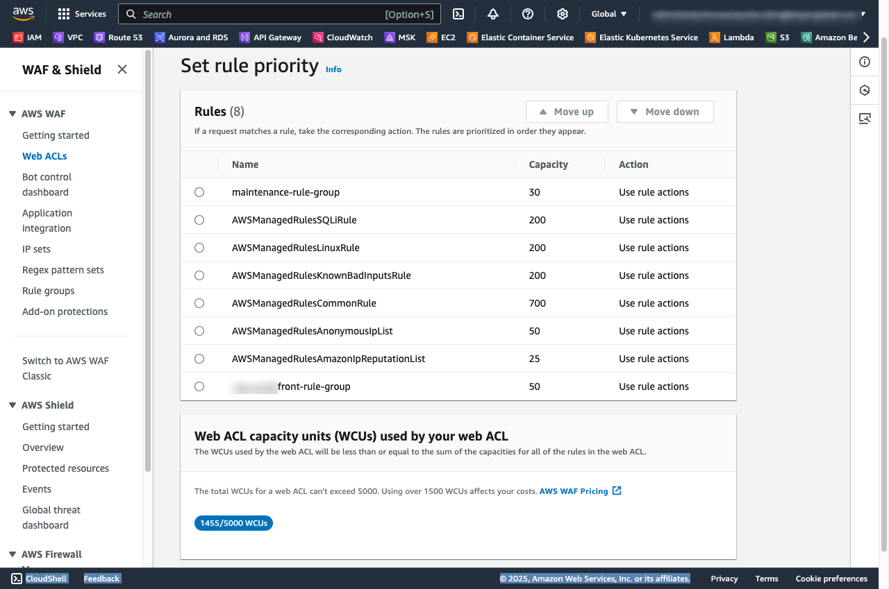

## AWS WAF를 통한 보안 위협과 대응 전략

인터넷 기반 웹 서비스는 다양한 보안 위협에 노출 되어 있습니다. 특히, DDoS 공격, SQL 인젝션, XSS, Bot 트래픽 등은 서비스의 가용성과 신뢰성을 저해할 수 있습니다.  

이러한 위협에 대응하기 위해 AWS에서는 AWS WAF(Web Application Firewall)를 제공 하여, 애플리케이션 계층(Layer 7)의 공격을 효과적으로 차단할 수 있도록 지원합니다.  


여기서는 보안 및 가용성과 신뢰성을 확보 하기 위해 웹서비스 아키텍처 및 AWS WAF를 통한 간단하면서도 효과적인 침해 대응 전략과 더불어, 운영 환경에서 대규모 업데이트를 위한 공사중 페이지를 활용하는 팁도 살펴보겠습니다. 


## WAF 와 통합 가능한 서비스

AWS WAF(Web Application Firewall)는 아래와 같이 보안이 필요한 AWS 서비스와 통합할 수 있습니다. 


## 웹서비스 아키텍처 모범 사례 

AWS 클라우드에서 웹 서비스 제공을 위해 보안이 강화 되고 간단한 아키텍처로 WEB UI 는 `CloudFront`로 배포 하고 `Backend API`는 `ALB (Application Load Balancer)` 또는 `API Gateway + NLB(Network Load Balancer)` 와 통합 하는 방식을 권고합니다.

## Application Load Balancer (ALB) 보안 그룹 방어 전략


위 아키텍처는 ALB (Application Load Balancer) 의 보안 그룹을 통해 CloudFront 의 요청만 허용하고 다른 어떤 요청도 거부할 수 있습니다.

특히 AWS를 이용하는 고객은 ALB 를 위한 보안 그룹에 AWS가 제공하는 CloudFront 에 대한 Managed Prefix List 를 사용 하여 아주 쉽게 방어 할 수 있습니다. 

VPC Managed prefix lists 목록에서 [global.cloudfront.origin-facing](https://aws.amazon.com/ko/blogs/korea/limit-access-to-your-origins-using-the-aws-managed-prefix-list-for-amazon-cloudfront/) 로 검색하면 확인 할 수 있습니다.


## WAF + Application Load Balancer (ALB)를 통합한 아키텍처

위의 ALB 보안 그룹 방어 전략은 Hacker 의 공격이 보안 그룹에 의해 차단 될 수 있겠지만, 해커의 공격 트래픽이 Backend ALB 영역 까지 도달 하게 된다는 것 입니다. 

이 것 자체가 DDoS 공격을 하게 되면 직접 적인 피해를 입게 되므로 보다 앞서서 해커의 공격을 방어할 필요가 있습니다. 

아래 다이어그램은 [ALB](https://docs.aws.amazon.com/elasticloadbalancing/latest/application/introduction.html) 와 [WAF Reginal](https://aws.amazon.com/waf/) 를 통합한 아키텍처 입니다.

AWS 클라우드가 제공하는 관리형 WAF 방화벽을 Backend 서비스 레이어 앞쪽에 배치함으로써 대부분의 침입자 공격을 차단할 수 있습니다.


### CloudFront HTTP 헤더를 이용한 WAF 방화벽 전략

`CloudFront`액세스만 허용하도록 WAF 방화벽 규칙을 구성할 수 있습니다.  

`CloudFront`의 Behavior 설정 중 `Cache policy and origin request policy` 정책 에서 `AllViewerAndCloudFrontHeaders`를 설정 하면 CloudFront의 Geo-Location 정보가 아래와 같이 HTTP 헤더로 제공됩니다.


- [cloudfront-geolocation-headers](https://aws.amazon.com/ko/about-aws/whats-new/2020/07/cloudfront-geolocation-headers/) 샘플

```
{
  'user-agent': 'Mozilla/5.0 (Macintosh; Intel Mac OS X 10_15_7) AppleWebKit/537.36 (KHTML, like Gecko) Chrome/136.0.0.0 Safari/537.36',
  'x-amz-cf-id': 'R14kBawplRj6Xk98UVmNry1HNwde-M76F3TkdoeWcbKUZpnw6QHc2A==',
  'x-forwarded-for': '222.0.0.106, 165.0.0.9',
  'via': '1.1 0859cbbec76cd864e788367b8aaae34a.cloudfront.net (CloudFront)',
  'accept-encoding': 'br,gzip',
  'cloudfront-viewer-country': 'KR',
  'cloudfront-viewer-country-name': 'South Korea',
  'cloudfront-viewer-country-region': '11',
  'cloudfront-viewer-country-region-name': 'Seoul',
  'cloudfront-viewer-city': 'Seoul',
  'cloudfront-viewer-postal-code': '04****',
  'cloudfront-viewer-time-zone': 'Asia/Seoul',
  'cloudfront-viewer-latitude': 'x7.50030',
  'cloudfront-viewer-longitude': '1**.95650',
  ....
}
```

`CloudFront` 헤더 정보 중 Geo-Location 중 하나인 `cloudfront-viewer-country` 값이 `KR`, `US` 인 항목만 허용 하도록 WAF 방화벽을 아래와 같이 구성할 수 있습니다. 

- `AllowKRAndUSCloudFrontViewerCountry` Rule-Group 설정 참고 

```json
{
  "Name": "AllowKRAndUSCloudFrontViewerCountry",
  "Priority": 10,
  "Action": {
    "Allow": {}
  },
  "VisibilityConfig": {
    "SampledRequestsEnabled": true,
    "CloudWatchMetricsEnabled": true,
    "MetricName": "AllowKRAndUSCloudFront-Country-metric"
  },
  "Statement": {
    "OrStatement": {
      "Statements": [
        {
          "ByteMatchStatement": {
            "SearchString": "KR",
            "FieldToMatch": {
              "SingleHeader": {
                "Name": "cloudfront-viewer-country"
              }
            },
            "TextTransformations": [
              {
                "Priority": 0,
                "Type": "LOWERCASE"
              }
            ],
            "PositionalConstraint": "EXACTLY"
          }
        },
        {
          "ByteMatchStatement": {
            "SearchString": "US",
            "FieldToMatch": {
              "SingleHeader": {
                "Name": "cloudfront-viewer-country"
              }
            },
            "TextTransformations": [
              {
                "Priority": 0,
                "Type": "LOWERCASE"
              }
            ],
            "PositionalConstraint": "EXACTLY"
          }
        }
      ]
    }
  }
}
```

위의 WAF Rule-Group 동작은 아래 CloudWatch Logs Insights 쿼리를 통해 확인을 할 수 있습니다. 

```
fields @timestamp, @message
| parse @message '{"name":"CloudFront-Viewer-Country","value":"*"}' as geoloc
| filter geoloc = 'KR'
| sort @timestamp desc
| limit 20
```


### CloudFront `IPSet`을 이용한 WAF 방화벽 전략

경험 많은 해커의 경우 HTTP 헤더를 변조 하여 WAF 방화벽을 무력화 할 수 있습니다.

심지어 해커의 Device IP Address 를 `CloudFornt`의 IP 로 변조한 공격도 가능합니다. 

하지만, 해커의 IP 주소를 변조 공격이 WAF를 통과했다 하더라도 TCP 프로토콜 규격상 SYN-ACK는 결국 CloudFront IP로 응답하기에 Hacker 로 전달 되지 않기 때문에 안전 하게 공격이 차단 됩니다.


AWS는 주요 서비스에 대해 `VPC Managed prefix list`의 [global.cloudfront.origin-facing](https://aws.amazon.com/ko/blogs/korea/limit-access-to-your-origins-using-the-aws-managed-prefix-list-for-amazon-cloudfront/) 뿐만 아니라, 
[aws-ip-ranges](https://docs.aws.amazon.com/vpc/latest/userguide/aws-ip-ranges.html) 를 통해 CloudFront 의 Edge Location 에 대한 IP 정보도 API 를 통해 제공 하고 있습니다.


아래 `ip-ranges.json` CLOUDFRONT 서비스에서 `region` 속성이 `GLOBAL`과 `ap-south-1`와 같이 해당 리전의 Edge Location 에 관한 CIDR 를 확인할 수 있습니다.

```
curl -O https://ip-ranges.amazonaws.com/ip-ranges.json 
```

우리는 `WAF & Shield` 의 `IP sets` 을 통해 Global 및 Regional 에 대한 CloudFront IP 를 구성할 수 있습니다.

- `cloudfront-ipsets` WAF Rule 예시


위 AWS IP Sets 으로 관리 되는 `cloudfront-ipsets` 의 ARN 값이 `arn:aws:wafv2:us-east-1:111122223333:regional/ipset/cloudfront-ipsets/a5a6` 이라면 
아래와 같이 WAF Rule Group 을 생성할 수있습니다. 

- cloudfront-rule-group Rule Group 예시

```json
{
  "Name": "cloudfront-ipsets-rule",
  "Priority": 11,
  "Action": {
    "Allow": {}
  },
  "VisibilityConfig": {
    "SampledRequestsEnabled": true,
    "CloudWatchMetricsEnabled": true,
    "MetricName": "cloudfront-ipsets-metric"
  },
  "Statement": {
    "IPSetReferenceStatement": {
      "ARN": "arn:aws:wafv2:us-east-1:111122223333:regional/ipset/cloudfront-ipsets/a5a6"
    }
  }
}
```


## WAF 를 활용한 공사중 페이지 전략

대규모 서비스 업데이트와 같이 휴일을 이용하여 장시간 서비스 절체 후 작업을 해야 하느 경우 공사중 페이지를 로드 하고 작업 해야 하는 경우가 있습니다.

이를 위해 Route53 도메인 부터 ALB 라우팅 등 프로덕션 환경을 대상 으로 여러 리소스를 수정 하는 것은 운영 환경에 변경이 일어 나는 위험한 작업일 뿐만아니라, 
몇몇 리소스의 설정을 변경해야 하는 부담스러운 작업이 됩니다.

하지만 ₩WAF`를 이용 하여 `maintenance-rule` 과 같은 단순한 규칙 으로 아주 쉽고 안전 하게 공사중 페이지를 작업할 수 있습니다. 

그리고 작업을 위한 내부 개발팀의 담당자에 대한 IP 들은 WAF 에 차단 되지 않도록 예외 처리를 하는 IP sets `deny-not-included-ipsets` 를 두어 패치 및 검증을 위해 허용할 수 있습니다. 


### 공사중 페이지를 위한 `maintenance-rule` WAF Rule  
`maintenance-rule` Rule Group 을 아래와 같이 `deny-not-included-ipsets` 에 포함된 IP 가 아니 라면 차단(Block) 하도록 규칙을 생성 하고, 
그 이외의 모든 클라이언트의 Action은 `maintenance-html` 키에 대한 CustomResponse HTML 컨텐츠를 응답하도록 구현할 수 있습니다.   

- `arn:aws:wafv2:us-east-1:111122223333:regional/ipset/deny-not-included-ipsets/0e3a****` IP sets 엔 개발팀 네트워크에 대한 IP 대역이 등록되어 있어야 합니다.
- `Custom response bodies` 의 key `maintenance-html` 엔 공사중 페이지를 렌더링 할 Html 컨텐츠가 구성 됩니다. 

- `maintenance-rule` Rule Group 예제  

```json
{
  "Name": "maintenance-rule",
  "Priority": 1,
  "Statement": {
    "NotStatement": {
      "Statement": {
        "IPSetReferenceStatement": {
          "ARN": "arn:aws:wafv2:us-east-1:111122223333:regional/ipset/deny-not-included-ipsets/0e3a****"
        }
      }
    }
  },
  "Action": {
    "Block": {
      "CustomResponse": {
        "ResponseCode": 503,
        "CustomResponseBodyKey": "maintenance-html"
      }
    }
  },
  "VisibilityConfig": {
    "SampledRequestsEnabled": true,
    "CloudWatchMetricsEnabled": true,
    "MetricName": "maintenance-rule-metric"
  }
}
```

- `maintenance-html` 구성 예시

`maintenance-rule` Rule Group 에 `Custom response bodies` 를 통해 아래와 같이 공사중 페이지를 생성 할 수 있습니다. 


참고로 html 항목은 최대 4 K bytes 로 제한 됩니다.


## WAF Web ACL 개요





<table>
<thead>
<tr>
    <td>속성</td>
    <td>설명</td>
    <td>예시</td>
</tr>
</thead>
<tbody>
 <tr>
      <td>v</td>
      <td>SPF 버전을 지정합니다. 현재 SPF 레코드는 항상 "v=spf1"로 시작하며, 해당 레코드가 SPF 정책임을 나타냅니다.</td>
      <td>v=spf1</td>
    </tr>
    <tr>
      <td>ip4</td>
      <td>도메인에서 발송을 허용하는 IPv4 주소 또는 주소 범위를 지정합니다.</td>
      <td>ip4:192.0.2.0/24</td>
    </tr>
    <tr>
      <td>ip6</td>
      <td>도메인에서 발송을 허용하는 IPv6 주소 또는 주소 범위를 지정합니다.</td>
      <td>ip6:2001:db8::/32</td>
    </tr>
    <tr>
      <td>a</td>
      <td>도메인의 A 레코드(IP 주소)를 기준으로 발송을 허용합니다. 선택적으로 다른 도메인을 지정할 수도 있습니다.</td>
      <td>a 또는 a:example.org</td>
    </tr>
    <tr>
      <td>mx</td>
      <td>도메인의 MX 레코드에 명시된 메일 서버의 IP 주소를 기반으로 발송을 허용합니다.</td>
      <td>mx 또는 mx:example.org</td>
    </tr>
    <tr>
      <td>include</td>
      <td>다른 도메인의 SPF 정책을 포함하여 해당 도메인의 허용 목록을 참조합니다.</td>
      <td>include:_spf.google.com</td>
    </tr>
    <tr>
      <td>exists</td>
      <td>특정 도메인에 대한 DNS 조회 결과가 존재하는지를 확인하여 발송을 허용합니다. 주로 동적 IP나 복잡한 설정에 활용됩니다.</td>
      <td>exists:%{i}.spf.example.org</td>
    </tr>
    <tr>
      <td>all</td>
      <td>앞에서 지정한 조건에 해당되지 않는 모든 IP에 대해 적용되는 메커니즘입니다. 보통 최종 정책으로 사용되며, qualifier에 따라 처리됩니다.</td>
      <td>-all (미일치 IP 거부) 또는 ~all (소프트 실패)</td>
    </tr>
    <tr>
      <td>redirect</td>
      <td>현재 SPF 레코드에서 매칭되는 조건이 없을 경우, 다른 도메인의 SPF 정책을 대체로 적용하도록 지정합니다.</td>
      <td>redirect=example.org</td>
    </tr>
    <tr>
      <td>exp</td>
      <td>SPF 검증에 실패한 경우, 수신자에게 제공할 추가 설명을 담은 도메인을 지정합니다.</td>
      <td>exp=explain.example.org</td>
    </tr>
</tbody>
</table>


### DMARC 정책 구성

DMARC(Domain-based Message Authentication, Reporting & Conformance)는 도메인 기반 메시지 인증, 보고 및 준수(DMARC)는 이메일 사기 및 피싱 공격에 대응하기 위해 설계된 이메일 인증 프로토콜입니다.

#### DMARC 동작 방식의 이해

`DMARC`는 회사가 소유한 도메인(예: example.org)에 대해 `SPF`및 `DKIM`정책을 적용 하고, 메일이 발송될 때 `SPF` 및 `DKIM` 결과를 기반으로 승인 되지 않은 이메일을 SPAM으로 분류 하고, 리포팅 보고서를 제공합니다.


`example.org` 도메인에 대해 `DMARC`정책이 아래와 같이 설정되어 있다면, `example.org` 도메인으로 발송되는 모든 이메일에 대해 DMARC1 버전의 정책으로 `SPF` 또는 `DKIM` 방식 둘 하나가 확인되지 않으면, SPAM 으로 간주 하여 `격리`하는것을 의미합니다. 집계 시간은 1 day(86400 secs)이며 관련 리포트를 `mail-master@example.org`으로 전송하도록 설정 합니다.

```
NAME                TYPE    VALUE
_dmarc.example.org  TXT     "v=DMARC1; p=quarantine; pct=100; rua=mailto:mail-master@example.org; aspf=r; adkim=r; fo=0; ri=86400;"
```


#### DMARC TXT 레코드 주요 속성 참고

<table>
  <thead>
    <tr>
      <th>Name</th>
      <th>Action</th>
      <th>Description</th>
    </tr>
  </thead>
  <tbody>
    <tr>
      <td>maintenance-rule-group</td>
      <td>Use rule actions</td>
      <td>개발팀 Network IP 를 제외한 모든 요청에 대해 공사중 페이지를 렌더링 합니다. </td>
    </tr>
    <tr>
      <td><a href="https://docs.aws.amazon.com/ko_kr/waf/latest/developerguide/aws-managed-rule-groups-use-case.html" target="_blank">AWSManagedRulesSQLiRule</a></td>
      <td>Use rule actions</td>
      <td>AWS 관리형 정책으로, SQL 명령어 주입 공격과 같은 SQL 데이터베이스 도용과 관련된 요청 패턴을 차단하는 규칙이 포함되어 있습니다.</td>
    </tr>
    <tr>
      <td><a href="https://docs.aws.amazon.com/ko_kr/waf/latest/developerguide/aws-managed-rule-groups-use-case.html#aws-managed-rule-groups-use-case-linux-os" target="_blank">AWSManagedRulesLinuxRule</a></td>
      <td>Use rule actions</td>
      <td>Linux 운영 체제 규칙 그룹에는 Linux 관련 로컬 파일 포함(LFI, Local File Inclusion) 공격을 포함하여 Linux에 특정한 취약성 도용과 관련된 요청 패턴을 차단하는 규칙이 포함되어 있습니다.</td>
    </tr>
    <tr>
      <td><a href="https://docs.aws.amazon.com/ko_kr/waf/latest/developerguide/aws-managed-rule-groups-baseline.html#aws-managed-rule-groups-baseline-known-bad-inputs">AWSManagedRulesKnownBadInputsRule</a></td>
      <td>Use rule actions</td>
      <td>알려진 잘못된 입력 규칙 그룹에는 유효하지 않은 것으로 알려져 있으며 취약성의 도용 또는 발견과 관련된 요청 패턴을 차단하는 규칙이 포함되어 있습니다. 이렇게 하면 악성 액터가 취약한 애플리케이션을 발견하는 위험을 줄일 수 있습니다.</td>
    </tr>
    <tr>
      <td><a href="https://docs.aws.amazon.com/ko_kr/waf/latest/developerguide/aws-managed-rule-groups-baseline.html#aws-managed-rule-groups-baseline-crs">AWSManagedRulesCommonRule</a></td>
      <td>Use rule actions</td>
      <td>핵심 규칙 집합(CRS, Core rule set) 규칙 그룹에는 일반적으로 웹 애플리케이션에 적용할 수 있는 규칙이 포함되어 있습니다. 이를 통해 OWASP Top 10과 같은 OWASP 게시물에 설명된 자주 발생하고 위험성 높은 일부 취약성을 비롯한 광범위한 취약성 도용을 막을 수 있습니다.</td>
    </tr>
    <tr>
      <td><a href="https://docs.aws.amazon.com/ko_kr/waf/latest/developerguide/aws-managed-rule-groups-ip-rep.html#aws-managed-rule-groups-ip-rep-anonymous">AWSManagedRulesAnonymousIpList</a></td>
      <td>Use rule actions</td>
      <td>익명 IP 목록 규칙 그룹에는 최종 사용자 ID 난독화를 허용하는 서비스의 요청을 차단하는 규칙이 포함되어 있습니다. 여기에는 VPN, 프록시, Tor 노드 및 웹 호스팅 공급자의 요청이 포함됩니다.</td>
    </tr>
    <tr>
      <td><a href="https://docs.aws.amazon.com/ko_kr/waf/latest/developerguide/aws-managed-rule-groups-ip-rep.html#aws-managed-rule-groups-ip-rep-amazon">AWSManagedRulesAmazonIpReputationList</a></td>
      <td>Use rule actions</td>
      <td>Amazon IP 신뢰도 목록 규칙 그룹에는 Amazon 내부 위협 인텔리전스를 기반으로 하는 규칙이 포함되어 있습니다. 이는 일반적으로 봇이나 다른 위협과 연결된 IP 주소를 차단하려는 경우에 유용합니다. 이러한 IP 주소를 차단하면 봇을 완화하고 악성 액터가 취약한 애플리케이션을 발견하는 위험을 줄일 수 있습니다.</td>
    </tr>
    <tr>
      <td>front-rule-group</td>
      <td>Use rule actions</td>
      <td>AWS 관리형 규칙 외에 서비스 워크로드를 위한 커스텀 방화벽 규칙을 구성할 수 있습니다. 여기엔 cloudfront IP 대역을 허용 하는 규칙, 서비스 도메인 (예: *.example.com) Host 패턴만 허용 하는 규칙, 
고객 및 개발 조직에 대한 NAT IP 대역 허용 규칙 등 필요한 규칙을 추가 할 수 있습니다.</td>
    </tr>
  </tbody>
</table>


## Conclude

AWS WAF를 핵심 방어 수단으로 삼아, 간단하면서도 효과적인 웹서비스 보안 아키텍처와 운영 전략을 살펴보았습니다.    

여러분의 AWS 클라우드 환경에서, 여기서 소개한 아키텍처와 WAF를 적용함으로써 서비스의 가용성 및 신뢰성을 확보하고, 
대규모 유지보수 시에도 안전하게 운영을 이어갈 수 있기를 희망 합니다.

